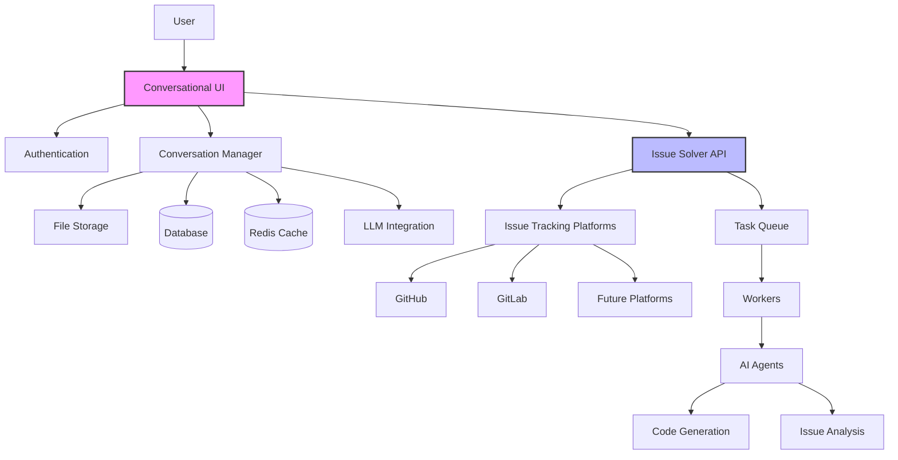
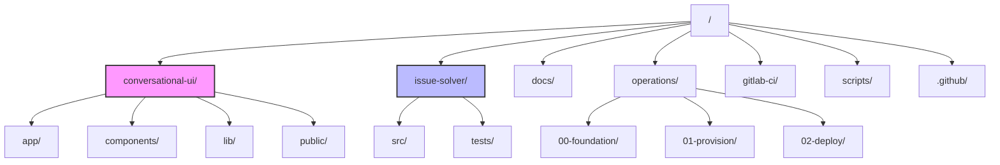
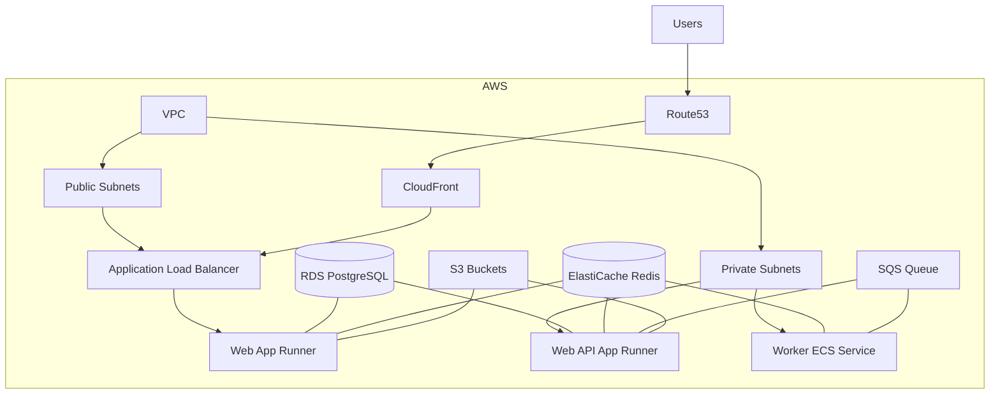
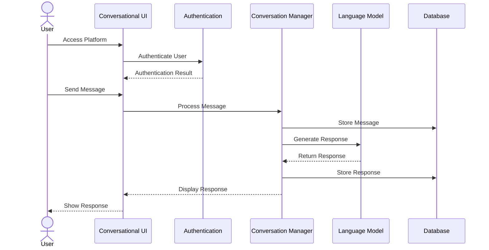
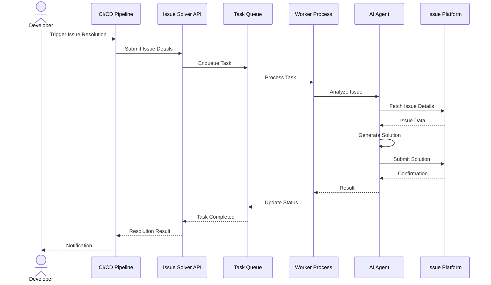

# umans.ai Platform


[](https://discord.gg/wBeQhw9v)

🚀 **umans.ai platform** integrates autonomous agents for software development, providing an intuitive conversational interface and powerful issue-solving capabilities. Innovate your workflow without being locked into a single platform.

## Table of Contents

- [Project Structure Overview](#project-structure-overview)
- [System Architecture](#system-architecture)
- [Component Details](#component-details)
- [Directory Structure](#directory-structure)
- [Deployment Architecture](#deployment-architecture)
- [Key Workflows](#key-workflows)
- [Onboarding Guide](#onboarding-guide)
- [Getting Started](#getting-started)
- [Next Steps](#next-steps)
- [Community and Support](#community-and-support)
- [Contribution](#contribution)
- [License](#license)

## Project Structure Overview

The umans.ai platform consists of two main components that work together to provide an end-to-end solution for AI-powered software development assistance:

### Conversational-UI

A modern web interface that provides users with an intuitive chat experience for interacting with AI agents. This component handles user authentication, conversation management, and serves as the frontend for the entire platform. It allows users to communicate with AI agents through a familiar chat interface, upload files for context, and receive intelligent responses.

### Issue-Solver

A powerful backend system that integrates with various issue tracking platforms (GitLab, GitHub, etc.) to automate the resolution of software development issues. It provides autonomous agents that can analyze issues, generate solutions, and submit code changes through CI/CD integrations.

These components interact seamlessly to provide a complete solution that can handle both conversational interactions and autonomous issue solving, giving users flexibility in how they engage with the AI capabilities.

## System Architecture

The following diagram shows the high-level architecture of the umans.ai platform and how the components interact:



## Component Details

### Conversational-UI

**Tech Stack:**
- **Frontend**: Next.js App Router with React Server Components
- **UI Framework**: shadcn/ui with Tailwind CSS and Radix UI
- **AI Integration**: Vercel AI SDK supporting multiple model providers
- **Data Persistence**:
  - PostgreSQL for chat history and user data
  - Vercel Blob for file storage
  - Redis for caching and session management
- **Authentication**: NextAuth.js

**Key Features:**
- Intuitive chat interface for interacting with AI agents
- File upload and context-aware responses
- History tracking and conversation management
- Authentication and user management
- Integration with issue-solver backend

### Issue-Solver

**Tech Stack:**
- **Backend**: Python with FastAPI
- **Database**: PostgreSQL with SQLAlchemy ORM
- **Task Queue**: Redis with Celery
- **CI/CD Integration**: Templates for GitLab CI and GitHub Actions
- **Containerization**: Docker with Compose for local development

**Key Features:**
- Integration with multiple issue tracking platforms (GitLab, GitHub)
- Autonomous issue analysis and resolution
- Code generation and review
- CI/CD pipeline integration
- Customizable AI agents and models:
  - `SWE-agent`: A general-purpose software engineering agent
  - `SWE-crafter`: An alternative agent with different capabilities

## Directory Structure

The following diagram shows the high-level directory structure of the project:



### Key Directories

- **`/conversational-ui`**: Next.js application for the chat interface
- **`/issue-solver`**: Python backend for issue resolution
- **`/operations`**: Terraform configurations for AWS deployment
- **`/docs`**: Project documentation including ADRs
- **`/gitlab-ci`**: GitLab CI integration templates
- **`/.github`**: GitHub Actions workflows and templates
- **`/scripts`**: Utility scripts for development and deployment

## Deployment Architecture

The umans.ai platform uses a comprehensive AWS-based architecture for deployment:



### Deployment Components:

1. **Foundation Layer**:
   - DNS zones configuration
   - Container registry setup
   - Base storage resources

2. **Provisioning Layer**:
   - VPC and network infrastructure
   - Database resources (PostgreSQL, Redis)
   - Storage resources (S3)

3. **Deployment Layer**:
   - App Runner services for web frontend and API
   - ECS for background workers
   - IAM configurations
   - Queuing and messaging systems

## Key Workflows

### Chat Interaction Flow

The following sequence diagram illustrates how users interact with the conversational interface:



### Issue Resolution Flow

The following sequence diagram shows how the issue solver processes and resolves issues:



## Onboarding Guide

Welcome to the umans.ai platform! Follow these steps to get onboarded:

1. **Set Up Access**
   - Request access to the GitHub repository
   - Join the Discord server for team communications
   - Set up AWS credentials for development (if needed)

2. **Understand the Codebase**
   - Review the system architecture diagrams
   - Familiarize yourself with the main components
   - Explore the directory structure
   - Read through the component-specific READMEs

3. **Development Environment Setup**
   - Follow the [Getting Started](#getting-started) guide to set up your local environment
   - Verify connectivity to required services

4. **First Contribution**
   - Pick a starter issue from the GitHub issues list
   - Follow the contribution guidelines in [CONTRIBUTING.md](CONTRIBUTING.md)
   - Submit your first pull request

5. **Continuous Learning**
   - Explore the documentation in the `/docs` directory
   - Review architectural decision records (ADRs) to understand design choices
   - Stay updated with team communications on Discord

## Getting Started

### Prerequisites

- Git
- Docker and Docker Compose
- Node.js (v18 or later) and pnpm for Conversational-UI
- Python 3.12+ for Issue-Solver
- AWS CLI (for deployment-related tasks)

### Setting Up Conversational-UI

1. **Clone the repository**:
   ```bash
   git clone https://github.com/umans-tech/issue-solver-bots.git
   cd issue-solver-bots
   ```

2. **Set up environment variables**:
   ```bash
   cd conversational-ui
   cp .env.example .env
   # Edit .env with your configuration
   ```

3. **Install dependencies and start development server**:
   ```bash
   pnpm install
   pnpm dev
   ```

4. **Access the UI** at [http://localhost:3000](http://localhost:3000)

### Setting Up Issue-Solver

1. **Navigate to the issue-solver directory**:
   ```bash
   cd issue-solver
   ```

2. **Set up environment variables**:
   ```bash
   cp .env.example .env
   # Edit .env with your configuration
   ```

3. **Start with Docker Compose**:
   ```bash
   docker-compose up -d
   ```

4. **Or set up local development environment**:
   ```bash
   # Create a virtual environment
   python -m venv .venv
   source .venv/bin/activate  # On Windows: .venv\Scripts\activate
   
   # Install dependencies
   pip install -e ".[dev]"
   
   # Run the API server
   uvicorn src.api.main:app --reload
   ```

## Next Steps

After setting up your environment, here are some suggested next steps to start contributing:

1. **Explore the Codebase**:
   - Run through the application flow to understand how components interact
   - Review the code structure and key modules

2. **Development Tasks**:
   - Check the GitHub Issues for tasks labeled "good first issue"
   - Review open pull requests to understand current development

3. **Component Focus Areas**:
   - **Conversational-UI**: Improve chat experience, add new UI features
   - **Issue-Solver**: Enhance issue analysis, add support for new platforms
   - **Infrastructure**: Optimize deployment, improve monitoring

4. **Documentation Contributions**:
   - Improve existing documentation
   - Add tutorials or guides for specific features
   - Document your own learning journey for future team members

5. **Testing**:
   - Add unit tests for new functionality
   - Contribute to integration tests
   - Participate in manual testing and bug hunts

## Community and Support

Join our community to get help, share feedback, or contribute!

[](https://discord.gg/wBeQhw9v)

- **Discord Server:** [Join us on Discord](https://discord.gg/wBeQhw9v)
- **GitHub Issues:** [Report issues or request features](https://github.com/umans-tech/issue-solver-bots/issues)

## Contribution

🤝 Contributions are welcome! Please refer to our [Contribution Guide](CONTRIBUTING.md) for details on how to participate in the development of this project.

- **Bug Reports & Feature Requests:** Open an issue on the [GitHub repository](https://github.com/umans-tech/issue-solver-bots/issues).
- **Pull Requests:** Submit pull requests for improvements or new features.

## License

This project is licensed under the **MIT License**. See the [LICENSE](LICENSE) file for details.
