# umans.ai Platform


[](https://discord.gg/Q5hdNrk7Rw)

# Deliver Value, Not Just Code

Bridge the gap between what your system does, what business needs, and what your team plans to build.

## Table of Contents

- [Why umans.ai?](#why-umansai)
- [Key Features](#key-features)
- [Quick Demo](#quick-demo)
- [Who Is This For?](#who-is-this-for)
- [System Architecture](#system-architecture)
- [Getting Started](#getting-started)
- [Development Workflow](#development-workflow)
- [Deployment](#deployment)
- [Supported Platforms and Agents](#supported-platforms-and-agents)
- [Early Stage and Feedback](#early-stage-and-feedback)
- [Community and Support](#community-and-support)
- [Contributing](#contributing)
- [License](#license)
- [Detailed System Architecture](#detailed-system-architecture)
  - [System Components](#system-components)
  - [Zoom on Conversational UI](#zoom-on-conversational-ui)
  - [Zoom on Remote Autonomous Agents (aka Issue Solver)](#zoom-on-remote-autonomous-agents-aka-issue-solver)

## Why umans.ai?

Software development is fundamentally about problem-solving, not just writing code.

We're exploring how AI can enhance the way teams work together to understand problems, align on solutions, and deliver
value continuously. umans.ai focuses on:

- **Shared Understanding**: AI agents that help teams build and maintain collective knowledge about complex codebases
- **Collaborative Problem-Solving**: Tools that facilitate discussion, exploration, and decision-making as a team
- **Continuous Alignment**: Bridging the gap between what we build, what we intend, and what users actually need
- **Augmented Teamwork**: AI that amplifies human collaboration rather than replacing human judgment

This is an exploration in how software teams can work more effectively together, with AI as a collaborative partner in
the problem-solving process.rs with AI. It's about augmenting human capabilities in the software delivery process.

## Key Features

- 🤖 **AI-Powered Assistance**: Conversational interface for code understanding and development tasks
- 🧠 **Codebase Understanding**: AI agents that analyze and understand your code structure and patterns, even for large
  codebases
- 👥 **Team Collaboration**: Shared workspaces for teams to collaborate on projects and share knowledge
- 🔄 **Automated Issue Resolution**: Self-hosted solution for automated issue solving with experimental integration in
  the conversational UI
- 🔌 **Multi-Platform Integration**: Connect with GitHub, GitLab, and self-hosted Git repositories
- 📊 **Task Management**: Track and monitor automated processes with a clean, intuitive interface

## Quick Demo

*Coming soon! Screenshots and demo videos of the platform in action will be added here.*

## Who Is This For?

- **Software Development Teams**: Collaborate more effectively with shared understanding of code
- **Technical Leads**: Gain insights into complex codebases and ensure alignment with business goals
- **Individual Developers**: Accelerate your workflow with AI assistance for coding tasks
- **Organizations**: Improve delivery speed and quality across multiple projects and teams

## System Architecture

### At a Glance

umans.ai explores collaborative software development through conversation and shared AI agents:

```mermaid
graph TD
    Human[👤 You] --> Conversation[💬 Natural Conversation]
    Conversation --> ConvAgent[🤖 Conversational Agent]
    
    ConvAgent --> Tools[🛠️ Instant Tools]
    Tools --> Browse[📚 Browse Codebase]
    Tools --> Diagram[📊 Create Diagrams]
    Tools --> Search[🔍 Web Research]
    
    ConvAgent --> RemoteAgent[🔧 Remote Coding Agent]
    RemoteAgent --> Code[💻 Write & Test Code]
    RemoteAgent --> PR[📝 Submit PR/MR]
    
    style Human fill: #e1f5fe
    style ConvAgent fill: #f3e5f5
    style RemoteAgent fill: #e8f5e8
    style PR fill: #fff3e0
```



## Getting Started

### Prerequisites

- Node.js 18+ and pnpm (for Conversational UI)
- Python 3.12+ (for Issue Solver)
- Docker and Docker Compose (for local development)
- Git

> [!TIP]
> Make sure Docker is running before starting the development servers. The project uses Docker for local databases and
> services.

### Project Structure

```bash
/
├── conversational-ui/     # Next.js frontend application
├── issue-solver/          # Python-based autonomous agent system
├── operations/            # Infrastructure and deployment
└── .github/workflows/     # CI/CD workflows
```

### Quick Start

The project uses [just](https://github.com/casey/just) as a command runner. Each component has its own justfile with
self-documented commands.

To list all available commands in any directory with a justfile:

```bash
just --list
```

#### For Conversational UI:

```bash
cd conversational-ui
just install      # Install dependencies
just dev          # Start development server with backing services
```

#### For Issue Solver:

```bash
cd issue-solver
just s            # Start backing services (LocalStack, etc.)
just api-start    # Start the API server
just w            # Start the worker process
```

## Development Workflow

### Conversational UI

```bash
cd conversational-ui
just lint         # Check code quality
just lint-fix     # Fix linting issues
just build        # Build for production
```

### Issue Solver

```bash
cd issue-solver
just t            # Run tests
just c            # Check typing
just l            # Lint code
just f            # Format code
```

## Deployment

```bash
# Provision infrastructure
cd operations/01-provision
just apply

# Deploy applications
cd ../02-deploy
just apply
```

> [!NOTE]
> For production deployments, make sure to review the environment variables in the `.env.example` files and set them
> appropriately.

## Supported Platforms and Agents

### Issue Tracking Platforms

- **GitHub**: Full integration with repositories and issues
- **GitLab**: Complete support for repositories and issue tracking
- **Self-hosted Git**: Support for custom Git deployments
- **Notion**: Available via secure MCP proxy integration
- **Jira**: Coming soon!

### Agents

- **Conversational Agent**: Assists with code understanding and development tasks
- **Issue Solver Agent**: Autonomously resolves issues and creates pull/merge requests
- **Code Review Agent**: Provides feedback on code changes (coming soon)

## Early Stage and Feedback

🚧 **Alpha Stage**: This project is in early development. We're actively working to improve and expand its capabilities.

🤗 **We Value Your Feedback**: Your insights and suggestions are crucial to us. Please share your feedback, report
issues, or propose enhancements to help us make the platform better.

## Community and Support

Join our community to get help, share ideas, and contribute to the project:

- [Discord Community](https://discord.gg/Q5hdNrk7Rw)
- [GitHub Issues](https://github.com/umans-tech/issue-solver-bots/issues)

## Contributing

We welcome contributions from the community! Whether it's bug reports, feature requests, documentation improvements, or
code contributions, your help is appreciated.

Please check out our [contributing guidelines](CONTRIBUTING.md) for details on our code of conduct and the process for
submitting pull requests.

> [!TIP]
> Start with small contributions to get familiar with the codebase. Good first issues are labeled in the issue tracker.

## License

This project is licensed under the Apache License 2.0 - see the [LICENSE](LICENSE)


## Detailed System Architecture

### System Components

The platform consists of two main subsystems working together:

```mermaid
flowchart TD
    User["👤 User<br/><i>[Person]</i><br/>Developer or team member"]
    
    ConvUI["📱 Conversational UI<br/><i>[Subsystem]</i><br/>User interface for chat, tasks,<br/>and repository interactions"]
    
    IssueSolver["⚙️ Issue Solver<br/><i>[Subsystem]</i><br/>Processes issue resolution tasks<br/>and manages codebase operations"]
    
    Git["🔗 Git Repositories<br/><i>[External System]</i><br/>GitHub, GitLab, Self-hosted"]
    LLM["🤖 LLM Providers<br/><i>[External System]</i><br/>OpenAI, Anthropic, etc."]
    Internet["🌐 Internet<br/><i>[External System]</i><br/>Web browsing and search"]
    
    User -->|"Interacts with"| ConvUI
    ConvUI -->|"Creates and monitors tasks"| IssueSolver
    ConvUI -->|"Explores and searches codebase"| Git
    ConvUI -->|"Uses for chat and assistance"| LLM
    ConvUI -->|"Browses for information"| Internet
    IssueSolver -->|"Indexes codebase, pulls code, pushes PRs"| Git
    IssueSolver -->|"Uses for code generation"| LLM
    
    classDef external fill:#999,stroke:#666,color:#fff,stroke-width:2px
    classDef subsystem fill:#4472C4,stroke:#2E5396,color:#fff,stroke-width:3px
    classDef person fill:#1f4e79,stroke:#0f2e4f,color:#fff,stroke-width:2px
    
    class Git,LLM,Internet external
    class ConvUI,IssueSolver subsystem
    class User person
```



### Zoom on Conversational UI

```mermaid
flowchart TD
    User["👤 User<br/><i>[Person]</i><br/>Developer or team member"]
    
    subgraph ConvUI ["Conversational UI Subsystem"]
        UI["Conversational UI<br/><i>[Container: Next.js]</i><br/>User interface for chat, tasks,<br/>and repository interactions"]
        ConvDB[("Conversational DB<br/><i>[Container: PostgreSQL]</i><br/>Stores conversations, user data,<br/>and spaces")]
        Redis[("Redis<br/><i>[Container: Redis]</i><br/>Manages resumable streams")]
        Blob[("Blob Storage<br/><i>[Container: S3/Blob]</i><br/>Stores codebase data")]
    end
    
    IssueSolver["⚙️ Issue Solver<br/><i>[Subsystem]</i><br/>Processes issue resolution tasks"]
    Git["🔗 Git Repositories<br/><i>[External System]</i><br/>GitHub, GitLab, Self-hosted"]
    LLM["🤖 LLM Providers<br/><i>[External System]</i><br/>OpenAI, Anthropic, etc."]
    Internet["🌐 Internet<br/><i>[External System]</i><br/>Web browsing and search"]
    
    User -->|"Interacts with"| UI
    User -->|"Streams from"| Redis
    UI -->|"Reads/writes user data<br/>and conversations"| ConvDB
    UI -->|"Creates resumable streams"| Redis
    UI -->|"Stores and retrieves<br/>codebase data"| Blob
    UI -->|"Creates and monitors tasks"| IssueSolver
    UI -->|"Uses for chat<br/>and assistance"| LLM
    UI -->|"Explores and searches<br/>codebase"| Git
    UI -->|"Browses for information"| Internet
    
    classDef external fill:#999,stroke:#666,color:#fff,stroke-width:2px
    classDef container fill:#5b9bd5,stroke:#2e75b5,color:#fff,stroke-width:2px
    classDef database fill:#5b9bd5,stroke:#2e75b5,color:#fff,stroke-width:2px
    classDef person fill:#1f4e79,stroke:#0f2e4f,color:#fff,stroke-width:2px
    classDef subsystem fill:#4472C4,stroke:#2E5396,color:#fff,stroke-width:3px
    
    class Git,LLM,Internet external
    class UI container
    class ConvDB,Redis,Blob database
    class User person
    class IssueSolver subsystem
```



### Zoom on Remote Autonomous Agents (aka Issue Solver)

```mermaid
flowchart TD
    ConvUI["📱 Conversational UI<br/><i>[Subsystem]</i><br/>User interface for chat and tasks"]
    
    subgraph IssueSolver ["Issue Solver Subsystem"]
        API["Web API<br/><i>[Container: FastAPI]</i><br/>Handles API requests<br/>and task management"]
        Queue["Message Queue<br/><i>[Container: SQS/Redis]</i><br/>Queues tasks for processing"]
        Worker["Worker<br/><i>[Container: Python]</i><br/>Processes issue resolution tasks.<br/>Indexes codebase, pulls code,<br/>and pushes PRs"]
        EventDB[("Event Store DB<br/><i>[Container: PostgreSQL]</i><br/>Stores task events<br/>and process data")]
    end
    
    Git["🔗 Git Repositories<br/><i>[External System]</i><br/>GitHub, GitLab, Self-hosted"]
    LLM["🤖 LLM Providers<br/><i>[External System]</i><br/>OpenAI, Anthropic, etc."]
    
    ConvUI -->|"Creates and monitors tasks"| API
    API -->|"Publishes tasks"| Queue
    API -->|"Reads/writes task data"| EventDB
    Queue -->|"Triggers"| Worker
    Worker -->|"Indexes codebase,<br/>pulls code, pushes PRs"| Git
    Worker -->|"Uses for code generation"| LLM
    Worker -->|"Updates task status"| EventDB
    
    classDef external fill:#999,stroke:#666,color:#fff,stroke-width:2px
    classDef container fill:#5b9bd5,stroke:#2e75b5,color:#fff,stroke-width:2px
    classDef database fill:#5b9bd5,stroke:#2e75b5,color:#fff,stroke-width:2px
    classDef subsystem fill:#4472C4,stroke:#2E5396,color:#fff,stroke-width:3px
    
    class Git,LLM external
    class API,Queue,Worker container
    class EventDB database
    class ConvUI subsystem
```


