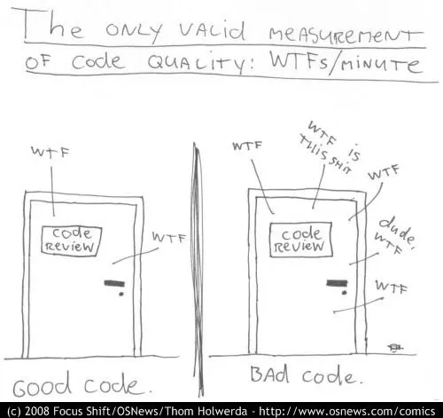

One of the most common complaints I hear about AI coding agents is:

> They helped ship the feature… but now the codebase feels like a patchwork.

And honestly, I get it.

Agents are very good at solving local problems. Sometimes they even surface better patterns than what we had before. But
they also make it easy to introduce yet another way of doing the same thing.

Over time, that hurts.

Not because “AI writes bad code” (even though it does sometimes), but because **AI doesn’t share our conventions by
default**.

Even when we add “be consistent with existing code” to our prompts, it often feels like it barely changes the outcome.

So let’s talk about consistency: why it still matters, what inconsistency actually looks like in a living codebase, and
how we are starting to use agents to manage it instead of making it worse.

One scope note before we dive in: I am talking about AI in the context of existing repositories and long-lived systems.
Real software that evolves over months and years, not a one-off prototype or a project scaffold you generate and then
throw away.

## Why consistency still matters

When you don’t have a shared way of doing things (humans or humans + AI), you pay a tax everywhere:

* **Higher cost of change**
  Every change starts with archaeology. You need to reverse-engineer how this part works before touching anything. You
  miss opportunities to reuse helpers, tests, fixtures, tooling… because nothing looks quite the same twice.

* **Higher cognitive load**
  Onboarding is painful. Reading code is full of “wait, why is it done like *this* here?” Each jump between files comes
  with a context switch in your head.

* **Less repeatability**
  If similar problems are solved in different ways, it’s harder to predict the impact of a change or to automate
  refactorings.

That’s what people usually mean when they complain about “AI patchwork”:
not just style differences, but **inconsistent ways of solving the same kind of problem**.

There is also a very direct impact on productivity. In teams that use agents, I see more and more PRs rejected not
because the solution is wrong, but because it does not fit the existing patterns.
If you keep accepting inconsistent code, the codebase becomes harder to work with over time.
If you keep rejecting AI-generated changes for inconsistency, you do not get much leverage from the agents either.
That tension is exactly why we need better ways to align agents with the conventions of a living codebase.

## What is inconsistency, really?

For me, inconsistency is very simple:

> **Doing the same thing in different ways, without a good reason.**

A few concrete examples.

**Error handling**

The codebase handles errors in at least three different ways with no clear pattern  
(throwing exceptions, returning Result/Either, logging and swallowing).

Impact: it is hard to reason about error flows. Is it logged? recorded somewhere? will it crash or degrade gracefully?  
Result: refactors are scary and people are never sure which pattern to follow.

**Time**

There are several ways to get “now” with no clear rule  
(`new Date()`, `datetime.now(UTC)`, injected `Clock`, etc.).

Impact: some parts of the code have testable time, others rely on the system clock.  
Result: you get flaky tests for time-sensitive logic and time zone bugs where the abstraction is not used.

**Configuration**

Environment variables are accessed in multiple ways across the codebase  
(direct `process.env` / `os.environ`, utility functions, different config loaders, hardcoded values in tests).

Impact: behaviour depends on where you are in the code.  
Result: debugging “works on my machine” and deployment issues turns into a treasure hunt.

Other flavours of the same problem:

- Logging done with different formats and levels, making incidents harder to investigate.
- Async code mixing callbacks, `.then()` and `async/await`.
- IDs generated in different layers for similar concepts.
- Domain concepts (`User`, `Customer`, `Client`) modelled differently without a clear context for why.

All of these create cognitive load because **the intent is not obvious**.

If the answers are not visible in the code or the documentation, every small decision requires archaeology.
And when intent is missing, people tend to add defensive code and speculation, which often makes things more complex
than the inconsistency itself.

## How inconsistency happens and how teams handled it before agents

### How inconsistency appears and sticks

Most inconsistencies do not come from “bad developers”.

They usually come from a mix of:

* Missing shared understanding of how things should be done.
* Decisions that were made verbally but never written anywhere.
* Important conversations that never happened because everyone was rushing to ship.

On top of that, there is the time factor.

A typical pattern looks like this:

1. Someone introduces a new way of doing something. Maybe it is a quick experiment to ship a feature, maybe it is just
   what the agent suggested that day.
2. It works well enough, so it stays.
3. Other people copy what they see locally.
4. Months later, you realise you now have three patterns for the same concern.

So the inconsistency you see in the code is rarely random. It’s either the absence of a real decision, or the side
effect of a decision that’s still slowly propagating through a living system.

### What helped consistent teams before agents

Before AI agents entered the picture, the most stable codebases I saw had one thing in common:
they were good at the loop **decide → record → apply**.

* **Decide**

  The team discusses trade offs and chooses an approach.
  Sometimes this is quite centralised, with a small group of people who own the technical direction.
  Sometimes it is more decentralised and collaborative.
  The structure can vary, but a decision is actually made.

* **Record**

  They write down the decision in a place that is a real source of truth.
  That can be an ADR, a short design note, or a coding guideline with concrete examples.
  The important part is that you can:

    * find the decision, and
    * understand the intent and the motivation behind it.

* **Apply**

  Finally, they make it possible to actually apply those decisions in the code:
    * **Tooling where it helps**: linters, CI checks, simple scripts that nudge the codebase back toward the agreed
      conventions.

    * **Building blocks and lightweight frameworks** that *reinforce* some decisions: shared modules, patterns, or base
      abstractions that make the “right way” the easy way. Not every decision deserves a framework, and these things
      have a cost, but when used well they reduce cognitive load, simplify testing, and even make living documentation
      possible.

The goal is not to mechanise everything. It is to make sure that when someone touches the code, they can see the intent,
follow the conventions, and understand *why* things are structured that way.

One important warning here:
if people only copy the pattern without understanding the intent, you get cargo cult.
[Cargo cult](https://en.wikipedia.org/wiki/Cargo_cult_programming) can be more harmful than inconsistency, because you
end up with complex structures nobody can explain.

The only reliable antidote is shared understanding. In teams that do this well, that understanding comes from everyday
practices: pair or mob programming on tricky changes, code reviews that talk about intent not just style, and spaces
where developers can think through design together. When that’s in place, the whole loop “decide → record → apply”
becomes much easier and more natural.

So for me, the health of a codebase is less about “is everything consistent” and more about:

> Can we understand why it is the way it is and still change it safely without getting lost?

When the answer is “yes”, consistency tends to show up as a side effect of that decide → record → apply loop, not as a
goal you chase directly.

## How AI agents change the picture?

AI agents sit right in the middle of this loop and disturb it in both good and bad ways.

On the risky side:

* They have been trained on a huge variety of styles and architectures.
* By default, they optimise for “solve this prompt here and now”, not “preserve the long term shape of this system”.
* Different models, prompts, and tools used by different people can multiply patterns very quickly.

So if your decide → record → apply loop is weak, agents will happily amplify the inconsistency you already have.

On the opportunity side:

* Agents can read and analyse more code than any human in one sitting.
* They can be fed your existing decisions, guidelines, and examples.
* They can help check how well the codebase follows the conventions you care about.

## Using agents to work with inconsistency

The angle we are exploring is simple:

> Let agents join the same loop (**decide → record → apply**) as humans instead of pretending they can replace it.

We have a few working hypotheses around that.

### 1. Make the implicit explicit

Today, most of the intent lives in people’s heads.  
Sometimes it is not even aligned between humans, so agents have nothing solid to connect to.

The first step has nothing to do with AI. It is on us:

- Adopt processes that force intent out in the open: discussions, design reviews, ADRs, written guidelines with concrete
  examples.
- Make sure these outcomes land in the repo (or somewhere accessible to the agent via tool or mcp), not just in slides
  or chats.

The challenge we are exploring is how to plug agents into those existing processes, not bypass them.  
When a team makes a decision, we want to turn it into **actionable artefacts** in the codebase that both humans and
agents can use: files that describe conventions, capabilities, and rules.

The goal is simple: an agent working on a task should be able to discover “how we do things here” by looking at the
repo, instead of us re-teaching the same things in every session.

### 2. Use agents to surface inconsistency

Once some conventions exist, a natural question is:

> How well does this codebase follow its own rules?

Here, agents are useful as scanners. They can map how time, config, async code, or domain concepts are handled across a
repo and highlight where patterns diverge. The goal is not to let them judge the code, but to give humans a clearer
picture of what is really happening so we can decide what to keep and what to change.

### 3. Use agents to apply decisions

The last step is applying decisions without overwhelming people.

At this point, the rules and conventions are written down; the question is how agents can help bring existing code
closer to them and keep new code from drifting.
The tempting mental model is: *“we feed our conventions to the agent and it will just generate consistent, working
code.”*  
In practice, conventions are incomplete, LLMs still hallucinate, and without running the code they have no grounded
signal when they are wrong. On top of that, large changes are hard to review. That’s the gap we are trying to close.

A few principles we are testing:

* Keep humans in the loop, with changes small enough to be reviewed and understood.
* Lean on executable feedback (tests, tools, static code analysis, checks) rather than pure “trust the LLM”.
* Run agents in environments that look like a real developer setup, so they can actually run the code and get concrete
  signals instead of guessing.

We are currently measuring how different models behave under these conditions: how well they follow repo-level
conventions, where they drift, how much review effort they create, and how much they really help reduce the cost of
bringing a codebase back in shape.

These are still hypotheses, not conclusions. This post is a snapshot of how we think about consistency with agents
today. In future articles, we’ll share more concrete experiments, metrics, and failures so we can refine these ideas
together with other teams facing the same questions.
