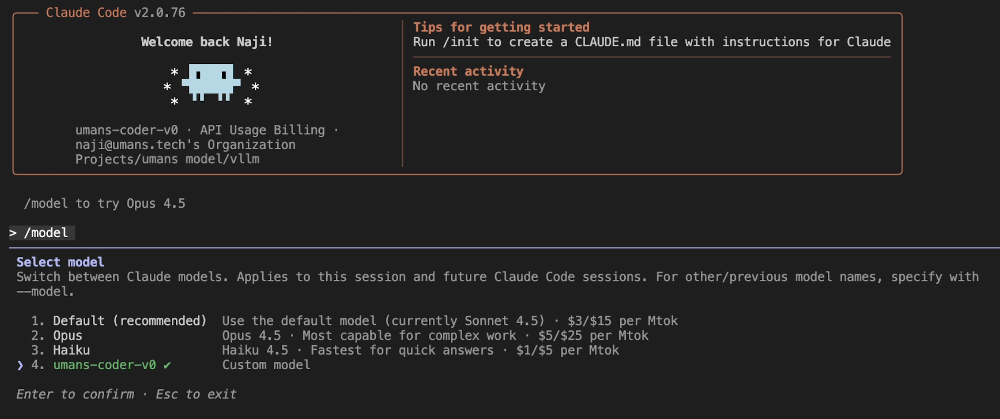
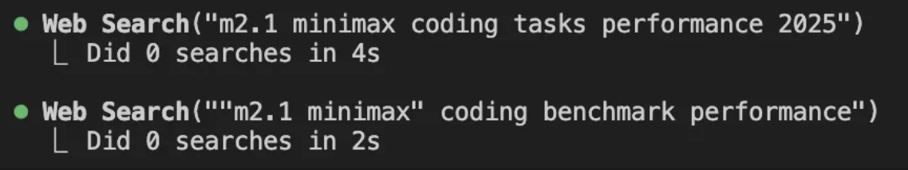

2025 is when coding agents went from "cool demo" to something people actually try in real repos.

Claude Code is the one we see the most, but the category is bigger than that: Codex CLI, Gemini CLI, and others. They read your codebase, change multiple files, run commands, and iterate when things break. The interaction feels different from autocomplete or chat.

And yet, there are two parallel realities. Online, it looks inevitable. Inside many companies, it is still a non-starter because source code cannot be sent to an external model endpoint. Security policy, compliance, contracts. If the model lives outside the perimeter, the tool does not matter.

The constraint isn't the agent. It's the model.

We put together a setup that runs Claude Code against a self-hosted model. The same approach works for other tools in this category. This post covers why we chose the model we did, how the pieces connect, and what we observed.

## Choosing a model for agentic coding

Not every capable model works well as a coding agent. Agentic coding requires a specific combination: the model needs to handle code generation, but it also needs to use tools reliably, maintain coherence across long interactions, and recover when something goes wrong. Models optimized for single-turn code completion often struggle when asked to operate as agents.

DeepSeek V3.2 is currently one of the strongest open-weights options for this use case. Their [technical report](https://arxiv.org/pdf/2512.02556) describes training specifically for agentic tasks, with a synthesis pipeline that generated prompts across code agents, search agents, and general tool-use scenarios. The results show up in benchmarks designed to measure this kind of work:

| Benchmark | DeepSeek V3.2 | GLM-4.7 | MiniMax-M2.1 | Claude Sonnet 4.5 | Gemini 3.0 | Claude Opus 4.5 | GPT-5.2 |
|-----------|---------------|---------|--------------|-------------------|------------|------------------|---------|
| SWE-bench Verified | 73.1% | 73.8% | 74.0% | 77.2% | 78.0% | **80.9%** | 80.0% |
| SWE-bench Multilingual | 70.2% | 66.7% | 72.5% | 68% | 65.0% | **77.5%** | 72.0% |
| Terminal Bench 2.0 | 46.4% | 41.0% | 47.9% | 50.0% | 54.2% | **57.8%** | 54.0% |

SWE-bench Verified is Python-only. SWE Multilingual covers the full language range, where DeepSeek outperforms the closed models. These benchmarks measure the ability to take a GitHub issue description and produce a working pull request, which is closer to real agent work than isolated code completion tasks.

Benchmark results can be gamed, and training data contamination is a real concern. Independent evaluations help validate these numbers. [SWE-rebench](https://swe-rebench.com/) runs continuously on new PRs specifically to resist contamination. [Artificial Analysis](https://artificialanalysis.ai/models?intelligence=agentic-index) runs these same benchmarks independently. Both rank DeepSeek V3.2 as the top open-weights model for agentic coding.

One practical consideration for self-hosting: DeepSeek V3.2 is a 671B mixture-of-experts model with 37B active parameters. A dense model of equivalent quality would be much larger and slower. Devstral 2, for example, is a dense 123B model that performs reasonably well on coding benchmarks. But because V3.2 only activates a fraction of its parameters per token, it runs roughly 3x faster at inference while having access to more total capacity. When you're paying for GPU time, this difference matters.

Don't over-index on total weight size either. In agentic workloads, long context and concurrency are what really bite. Each active request carries large KV caches (files, logs, traces), so VRAM grows quickly as you add users.

This is where attention architecture matters. DeepSeek's FlashMLA stack targets MLA + sparse kernels on Hopper/Blackwell and supports FP8 KV cache, which is explicitly aimed at keeping memory and throughput under control for long contexts ([Hopper FP8 sparse deep dive](https://github.com/deepseek-ai/FlashMLA/blob/main/docs/20250929-hopper-fp8-sparse-deep-dive.md), [kernel deep dive](https://github.com/deepseek-ai/FlashMLA/blob/main/docs/20250422-new-kernel-deep-dive.md)). MiniMax explains why M2 uses full attention, which keeps quality but makes KV cache scale more steeply with long contexts ([blog](https://huggingface.co/blog/MiniMax-AI/why-did-m2-end-up-as-a-full-attention-model)).

The nuance is that "concurrency" here is not just total sessions; it is concurrent requests. You rarely batch all sessions at once. Real usage is bursty: a user goes idle, then becomes active again, and you pay the cost of loading/refreshing long context. That makes time-to-first-token and context loading speed matter. In practice, with higher concurrent requests, DSA models like DeepSeek V3.2 can be more efficient than full-attention models like GLM 4.7 or M2.1 even if the weights are larger. If you have very few users or plenty of headroom, this difference matters much less. For capacity planning, start from your expected active-user ratio (Claude's cost model assumptions are a decent proxy: [costs page](https://code.claude.com/docs/en/costs)) and then compare how each model's attention/KV cache scales with long context.

KV cache sizing at 100 concurrent requests (128k context):

If you assume ~100 concurrent in-flight requests, the KV cache footprint alone looks like this:

- DeepSeek V3.2 (DSA): ~5 GB per request -> ~500 GB for 100 requests
- GLM-4.7 (full attention, GQA): ~23 GB per request -> ~2.3 TB for 100 requests
- MiniMax-M2.1 (full attention): ~16 GB per request -> ~1.6 TB for 100 requests

These numbers are KV cache only (no weights, no activations). The point is directionality: as concurrent requests grow, DSA can be significantly more memory-efficient even if the model weights are larger.


## Setup

We packaged the model as `umans-coder-v0` ([HuggingFace](https://huggingface.co/umans-ai/umans-coder-v0)). For text requests, it has the same capabilities as DeepSeek V3.2. We'll explain later why we did that and what our variant adds.

The architecture looks like this:

<iframe
  src="/blog/architecture_diagram.html"
  style="width: 100%; max-width:200%; height: 350px; border: none; background: transparent; transform: display: block; margin: 0 auto;"
  loading="lazy"
></iframe>

Claude Code expects to talk to an Anthropic-compatible API. The [gateway requirements](https://code.claude.com/docs/en/llm-gateway) specify what this means: the `/v1/messages` endpoint, the `/v1/messages/count_tokens` endpoint for token counting, and specific headers like `anthropic-beta` and `anthropic-version`.

[vLLM](https://github.com/vllm-project/vllm) now has an [Anthropic messages endpoint](https://docs.vllm.ai/en/stable/api/vllm/entrypoints/anthropic/), but it doesn't implement token counting or handle the required headers that Claude Code depends on. [LiteLLM](https://docs.litellm.ai/) fills this gap. It receives requests in the Anthropic format from Claude Code, translates them to the format vLLM expects, and handles the headers and endpoints that vLLM doesn't support natively.

## Deployment

We published Docker images built on our [vLLM fork](https://github.com/umans-ai/vllm). The primary runtime image is `umansai/vllm:0.1.3`.

It includes [DeepGEMM](https://github.com/deepseek-ai/DeepGEMM) for optimized inference on Hopper and Blackwell GPUs.

Quickstart in Docker (set `--tensor-parallel-size` to your GPU count; if you see `sm_103a`/ptxas errors on B200/B300, set `TRITON_PTXAS_PATH`; if weights are not cached, pass `HF_TOKEN` and `HF_XET_HIGH_PERFORMANCE=1`):

```bash
docker run --gpus all --rm --ipc=host -p 8000:8000 \
  -v /data:/data \
  -e HF_HOME=/data/hf \
  -e HF_TOKEN=$HF_TOKEN \
  -e HF_XET_HIGH_PERFORMANCE=1 \
  -e TRITON_PTXAS_PATH=/usr/local/cuda/bin/ptxas \
  umansai/vllm:0.1.2 \
  uv run vllm serve umans-ai/umans-coder-v0 \
    --host 0.0.0.0 --port 8000 \
    --tensor-parallel-size 8 \
    --tokenizer-mode deepseek_v32 \
    --tool-call-parser deepseek_v32 \
    --enable-auto-tool-choice \
    --reasoning-parser deepseek_v3
```

If you want interactive access (debugging, log inspection, manual launches), we also publish an SSH-enabled variant, `umansai/vllm:0.1.3-ssh`, which starts an `sshd` inside the container and lets you SSH in using your public key via environment variables in your platform template (useful on providers like Prime Intellect).

On a bare-metal 8-GPU node, we run vLLM directly like this (adjust `--tensor-parallel-size` to your GPU count):

```bash
cd /opt/umans_vllm
export TRITON_PTXAS_PATH=/usr/local/cuda/bin/ptxas
export HF_XET_HIGH_PERFORMANCE=1
export HF_TOKEN=hf_token

uv run --no-sync vllm serve umans-ai/umans-coder-v0 \
  --host 0.0.0.0 --port 8000 \
  --tensor-parallel-size 8 \
  --tokenizer-mode deepseek_v32 \
  --tool-call-parser deepseek_v32 \
  --enable-auto-tool-choice \
  --reasoning-parser deepseek_v3 \
  --max-model-len 131072 \
  --served-model-name umans-coder-v0
```

We tested this on 8xH200, 8xB200, 4xB300 and 8xB300.

## Connecting Claude Code

Once the model is running, you need to configure LiteLLM and point Claude Code at it.

### LiteLLM configuration

<!-- TODO: Expand with full setup details -->

```yaml
litellm_settings:
  drop_params: true

model_list:
  - model_name: umans-coder-v0
    litellm_params:
      model: hosted_vllm/umans-coder-v0
      api_base: http://127.0.0.1:8000/v1
      max_tokens: 20000
      temperature: 1
      top_p: 0.95
      chat_template_kwargs:
        thinking: true
```

Start the proxy:

```bash
uv run litellm --config ./config.yaml --port 4000
```

### Claude Code configuration

Point Claude Code at the LiteLLM proxy:

```bash
export ANTHROPIC_BASE_URL=http://localhost:4000
```

Claude Code can also spin up background/sub-agent calls using Haiku defaults unless you override them ([model config env vars](https://code.claude.com/docs/en/model-config#environment-variables)). If you don't map those to a model you actually serve, you'll get `claude-haiku-...` requests that LiteLLM can't satisfy. The simplest fix is to pin everything to your hosted model name (match the `model_name` you set in LiteLLM):

```bash
export ANTHROPIC_MODEL=umans-coder-v0
export ANTHROPIC_DEFAULT_HAIKU_MODEL=umans-coder-v0
export CLAUDE_CODE_SUBAGENT_MODEL=umans-coder-v0
```

You can also set the same values in `.claude/settings.local.json` instead of environment variables ([settings scopes](https://code.claude.com/docs/en/settings)).

Once pointed at the proxy, Claude Code sees the hosted model normally:


Claude Code picks up the self-hosted model through LiteLLM.

Full session example (multi-file edits, greps, tool calls):

<figure>
  <video controls playsinline preload="metadata">
    <source src="/blog/umans-coder-v0-claude-code-full-session.mp4" type="video/mp4" />
  </video>
  <figcaption style="text-align: center; font-size: 0.9em; color: #666;">
    A full Claude Code session against umans-coder-v0 (multi-file edits, grep, tool calls).
  </figcaption>
</figure>

## What we observed

The workflow works. Multi-file edits, streaming responses, iterative debugging. The interface is unchanged since it's still Claude Code.

Capabilities land where the benchmarks suggest. Refactors, test generation, bug fixes all work. The model reasons through problems and recovers from errors. For agent frameworks that simulate tool calls via user messages, [DeepSeek's report](https://arxiv.org/pdf/2512.02556) notes that non-thinking mode tends to work better. Claude Code handles both modes.

### Hosted tools caveat (WebSearch)

One gotcha: hosted Anthropic tools (like WebSearch) don't run when Claude Code is pointed at a self-hosted model. That's fine for data residency, but the calls fail silently and the model still receives a "successful" response, which can confuse it. In practice you'll see the tool call in the log, but zero searches executed.

Example from the log:


The tool call shows up, but zero searches are actually executed.

We recommend explicitly disabling those hosted tools (the [Claude Code CLI](https://docs.claude.com/en/docs/claude-code/cli-usage) supports `--disallowedTools`):

```bash
claude --disallowedTools "WebSearch"
```

### MCP as the alternative

We tested MCP as the alternative path: Claude Code supports [MCP servers](https://docs.claude.com/en/docs/claude-code/mcp) and it works cleanly with hosted models. This also doubles as a replacement for WebSearch when you still want a live search tool (at the cost of data egress).

To add Exa MCP (note: this sends data outside your perimeter), use the hosted server and expose the [`web_search_exa` tool for real-time search and `get_code_context_exa` for code/documentation retrieval](https://docs.exa.ai/reference/exa-mcp):

```bash
claude mcp add --transport http exa "https://mcp.exa.ai/mcp?exaApiKey=EXA_API_KEY&tools=web_search_exa,get_code_context_exa"
```

<figure>
  <video controls playsinline preload="metadata">
    <source src="/blog/umans-coder-v0-using-mcp.mp4" type="video/mp4" />
  </video>
  <figcaption style="text-align: center; font-size: 0.9em; color: #666;">
    MCP web search + code context (Exa) running inside Claude Code.
  </figcaption>
</figure>

<!-- SCREENSHOT: Multi-file edit completing successfully -->

## The remaining gap

The main thing missing is vision.

Claude Code's full workflow includes sending screenshots, mockups, and error traces. When you can show the agent what's wrong instead of describing it, the interaction changes.

DeepSeek V3.2 is text-only. Vision models exist in the open-weights space, but they're generally not at the same level on agentic coding tasks. Adding vision capabilities tends to come at the cost of performance on the tasks that matter for this use case.

We're working on closing that gap. The approach is to start from a strong agentic coding base and add vision without degrading the rest. `umans-coder-v0` is the foundation for that work.

More on that soon 👀.

## Appendix: KV cache sizing assumptions

DeepSeek V3.2:
- FlashMLA sparse backend notes FP8 KV cache format is 656 bytes per token.
- 128k context: 656 * 128k ~= 86 MB per layer.
- DeepSeek V3.2 has 61 layers -> ~5 GB per in-flight request.

Full attention (GQA) formula:
- KV bytes per token = 2 * num_key_value_heads * head_dim (FP8).

GLM-4.7:
- num_key_value_heads = 8, head_dim = 128, num_hidden_layers = 92.
- 2 * 8 * 128 = 2048 bytes per token -> ~256 MB per layer @ 128k.
- 256 MB * 92 ~= 23 GB per in-flight request.

MiniMax-M2.1:
- num_key_value_heads = 8, head_dim = 128, num_hidden_layers = 62.
- 2 * 8 * 128 = 2048 bytes per token -> ~256 MB per layer @ 128k.
- 256 MB * 62 ~= 16 GB per in-flight request.
