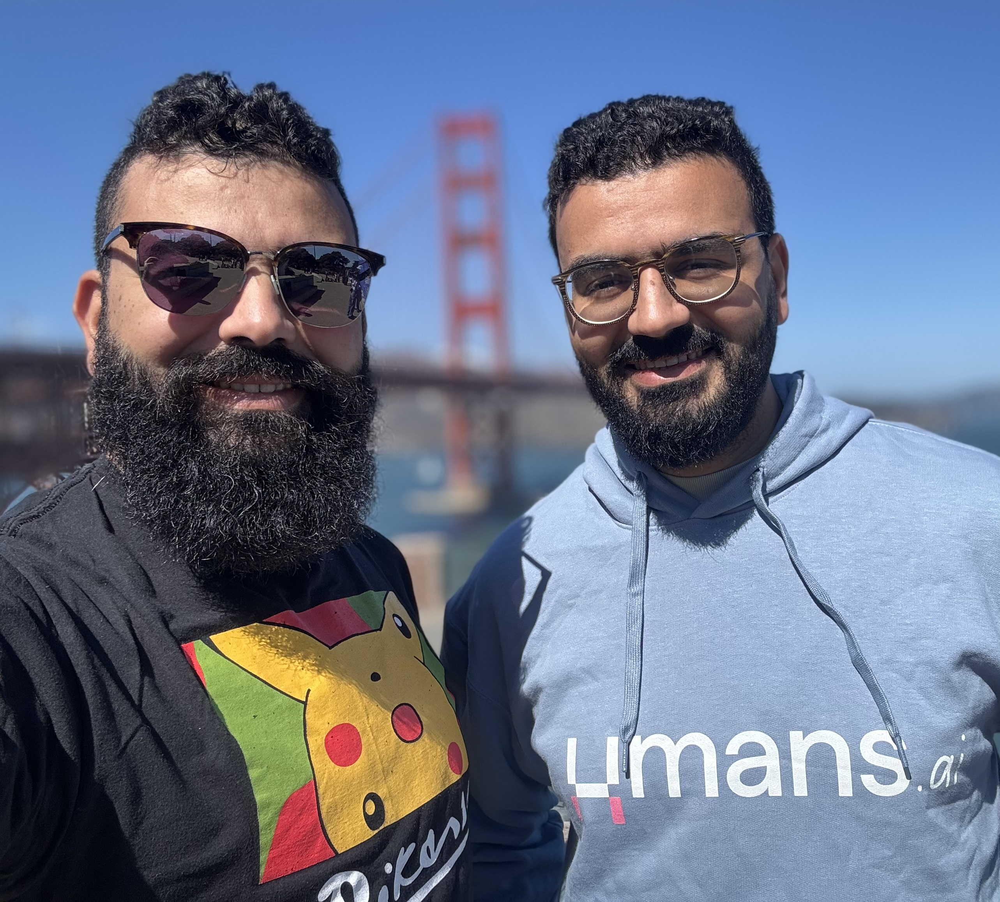

We are Wassel and Naji Alazhar, brothers and cofounders.

Most days we are building tools to help software teams work with AI on real systems. This blog is where we keep a trace
of what we try, what we learn, and what goes wrong along the way.

You will find experiments with agents on real codebases, ideas to keep intent and code aligned, and a few honest
opinions about what actually helps in practice. We try to keep it simple, concrete, and a bit fun.

If you want to say hi, challenge an idea, or share your own experiments:

- [Wassel on LinkedIn](https://www.linkedin.com/in/wassel-alazhar/) · [X](https://x.com/wasselovski)
- [Naji on LinkedIn](https://www.linkedin.com/in/naji-alazhar/) · [X](https://x.com/naji_alazhar)

