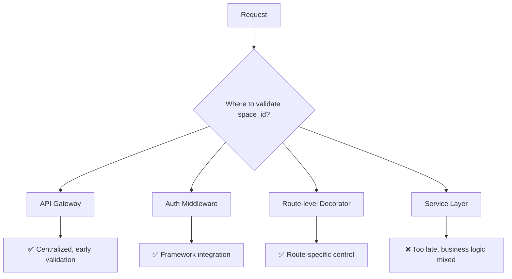

# 3. Space-centric MCP Tool Access

Date: 2025-07-21

## Status

Accepted

## Context

The MCP (Model Context Protocol) tools proxy was implementing user-centric repository access, where only the user who
originally connected a repository to a space could access MCP tools. This conflicted with the space-centric
collaboration model where all users within a space should have access to shared resources.

**Problem**: Repository connections were filtered by both `user_id` and `space_id`, causing MCP tools to be unavailable
to other space members who didn't originally connect the repository.

**Impact**:

- Inconsistent tool availability within teams
- Broken shared workspace functionality
- Poor user adoption of MCP features

## Decision

We will implement **space-centric repository access** for MCP tools:

1. **Repository Lookup**: The `get_connected_repo_event` function will filter by `space_id` only, allowing any space
   member to access repositories connected to that space
2. **Security**: Space membership validation remains handled at the API gateway/authentication layer
3. **Backward Compatibility**: The `user_id` parameter is retained but unused to maintain API compatibility

## Consequences

**Positive**:

- All space members can access MCP tools for repositories connected to their space
- Consistent with space-centric collaboration model
- Improved user experience and tool adoption
- Simpler access logic aligned with domain model

**Negative**:

- **Space membership validation not yet implemented - temporary security gap**
- **Unclear space_id validation boundaries in API architecture**

### Risks & Limitations

**Current Limitation**: Space membership validation is not yet implemented, creating a temporary security gap where any
authenticated user could potentially access repositories by providing a valid space_id.

**Mitigation Plan**: Implement space membership validation in [API middleware/gateway/auth layer] before this change is
deployed to production.

### Follow-up Decisions Required

- **ADR-004**: Define space membership validation architecture
- **ADR-005**: Establish space_id validation patterns across API

We need to clarify:

- **Where** should space validation happen?
- **How** should space_id be validated across the API?
- **What** is the space membership model?

#### Potential Validation Layers

### Implementation

**Phase 1** (This PR):
Modified repository lookup to use space-only filtering
`/issue-solver/src/issue_solver/webapi/routers/mcp_repositories_proxy.py`:

- `get_connected_repo_event()` now queries by `{"space_id": space_id}` only
- Added explicit space_id validation with clear error messages
- Enhanced documentation explaining the space-centric access model

- ⚠️ **Security gap**: Space membership validation pending

**Phase 2** (Required before production):

- Implement space membership validation middleware
- Define space_id validation patterns