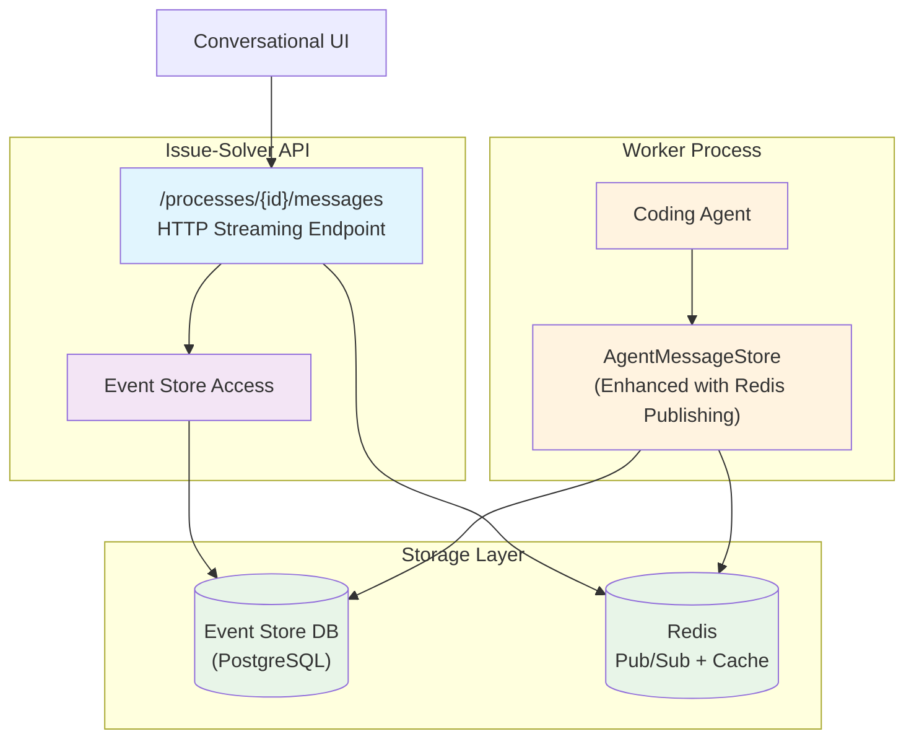
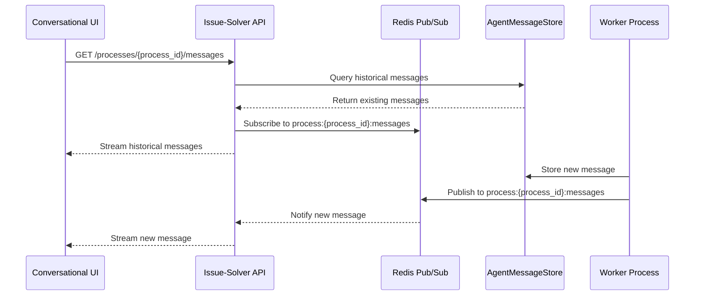
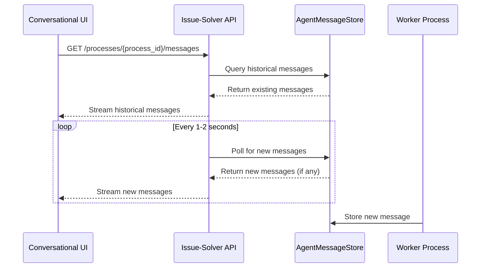
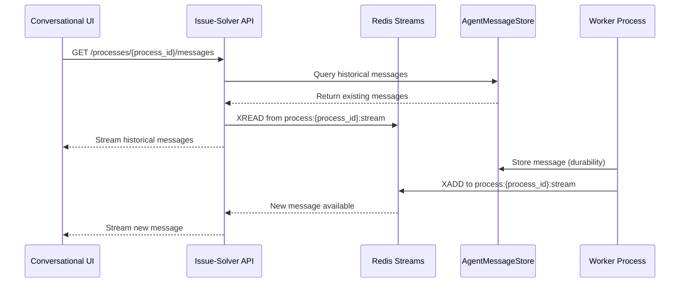

# 4. HTTP Streaming API for Process Messages with Redis Pub/Sub Integration

Date: 2025-07-22

## Status

Proposed

## Context

We need to provide our users with real-time visibility into remote coding agent progress during issue resolution
processes. Users currently have no insight into what coding agents are doing, making it difficult to understand
progress, debug issues, or build confidence in the autonomous resolution process.

**Current Architecture Constraints:**

- AgentMessageStore already exists for storing agent messages in PostgreSQL
- Redis is used for resumable streams in Conversational UI
- Event-driven architecture with SQS for task processing
- FastAPI with existing streaming capabilities

**Business Need:**
Users need real-time feedback on coding agent progress to understand what the agent is doing, track progress milestones,
and debug issues when they occur. This transparency is crucial for user adoption and trust in autonomous coding agents.

**Reference**: See [Issue #123](https://github.com/umans-tech/issue-solver-bots/issues/123)
and [Issue #148](https://github.com/umans-tech/issue-solver-bots/issues/148) for detailed technical requirements
including endpoint specification and response format.

## Decision

We will implement **Event-Driven with Redis Pub/Sub Integration** for the HTTP streaming API.

**Architecture Overview:**

**Key Decision Factors:**

1. **Leverages Existing Infrastructure**: Uses current AgentMessageStore and Redis setup
2. **Minimal Disruption**: Extends existing patterns rather than replacing them
3. **Real-time Performance**: Provides immediate message delivery via pub/sub
4. **Reliability**: Historical messages guaranteed via existing PostgreSQL storage
5. **Scalability**: Redis pub/sub handles multiple concurrent clients efficiently

**Architecture Components:**

- **Enhanced AgentMessageStore**: Adapter implementation that publishes to Redis after database append
- **HTTP Streaming Endpoint**: `/processes/{process_id}/messages` with FastAPI StreamingResponse
- **Message Format Conversion**: Maps agent messages to streaming API format
- **Redis Pub/Sub Channels**: Process-scoped channels (`process:{process_id}:messages`)

## Considered Options

### Option 1: Event-Driven with Redis Pub/Sub ⭐ (Selected)

**Flow**: Worker → AgentMessageStore + Redis Pub/Sub → Issue-Solver API → UI

**Pros:**

- ✅ Real-time message delivery
- ✅ Leverages existing Redis infrastructure
- ✅ Decoupled architecture
- ✅ Handles multiple concurrent clients
- ✅ Built-in message ordering
- ✅ Integrates seamlessly with existing AgentMessageStore

**Cons:**

- ❌ Redis pub/sub doesn't persist messages (mitigated by AgentMessageStore)
- ❌ Slightly more complex implementation

### Option 2: Database Polling with WebSocket Fallback

**Flow**: Worker → AgentMessageStore ← (Polling) Issue-Solver API → UI

**Pros:**

- ✅ Simple implementation
- ✅ Reliable (database-backed)
- ✅ No additional infrastructure

**Cons:**

- ❌ Higher latency (polling interval)
- ❌ Increased database load
- ❌ Not truly real-time

### Option 3: Hybrid Redis Streams + AgentMessageStore

**Flow**: Worker → AgentMessageStore + Redis Stream → Issue-Solver API → UI

**Pros:**

- ✅ Best of both worlds: real-time + durability
- ✅ Redis Streams provide ordering and persistence
- ✅ Can handle client reconnection gracefully
- ✅ Built-in consumer groups for scaling

**Cons:**

- ❌ More complex implementation
- ❌ Dual storage (Redis + DB)
- ❌ Additional Redis Streams learning curve

## Consequences

**Positive:**

- Real-time visibility into coding agent progress enhances user experience and trust
- Seamless integration with existing codebase patterns minimizes development risk
- Scalable to multiple concurrent clients per process
- Maintains message durability through existing AgentMessageStore
- HTTP streaming format compatible with frontend consumption
- Enables debugging and monitoring of agent behavior

**Negative:**

- **Additional Infrastructure Dependency**: Issue-Solver now requires Redis, impacting:
    - **Local Development**: Need to add Redis to docker-compose setup
    - **Deployment**: Must provision Redis service (can reuse Conversational UI's Redis but maintain API boundaries)
    - **Operational Complexity**: Additional service to monitor and maintain
- **Architectural Divergence**: This streaming approach differs from Conversational UI's streaming patterns, potentially
  creating inconsistency
- Message format conversion adds slight complexity
- Redis pub/sub messages are not persisted (mitigated by database storage)
- Requires careful handling of client disconnections

**Infrastructure Impact:**

- **Local Environment**: Add Redis container to Issue-Solver's docker-compose
- **Production**: Can leverage existing Redis instance used by Conversational UI, but must ensure proper namespace
  isolation and respect service boundaries
- **Monitoring**: Need Redis-specific monitoring for pub/sub performance

**Risks & Mitigations:**

- **Risk**: Redis unavailability breaks real-time streaming
    - **Mitigation**: Historical messages still available via database; graceful degradation
- **Risk**: Cross-service Redis dependency creates coupling
    - **Mitigation**: Use separate Redis databases/namespaces; maintain clear API contracts
- **Risk**: Message ordering issues with concurrent publishing
    - **Mitigation**: Redis pub/sub maintains order within single publisher; agent messages are sequential

**Follow-up Decisions Required:**

- Redis deployment strategy (shared vs. dedicated instance)
- Message retention policy for Redis channels
- Monitoring and alerting for streaming performance
- Client-side reconnection strategy
- Namespace/database separation strategy for shared Redis

This decision enables real-time coding agent visibility while building on proven infrastructure patterns, supporting the
broader goal of transparent and debuggable autonomous agent operations.