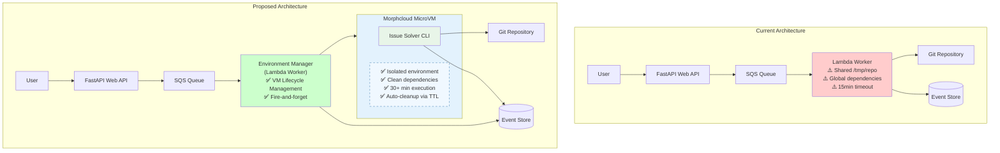
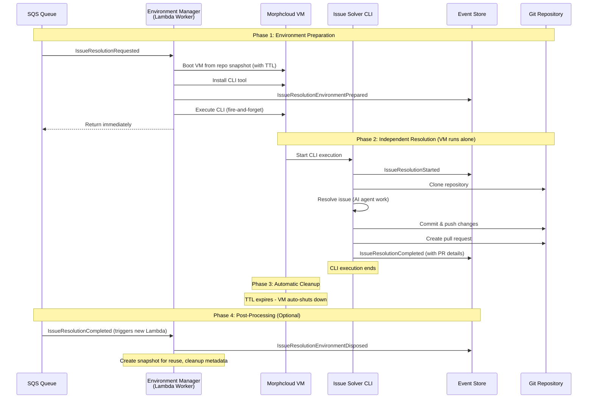

# 5. Use MicroVM Architecture for Isolated Issue Resolution

Date: 2025-08-08

## Status

Accepted

## Context

Our current issue resolution system suffers from significant isolation and scalability problems that impact reliability
and user experience:

**Current Problems:**

- All issue resolutions share the same Lambda execution environment
- Only folder-level separation (`/tmp/repo/{process_id}`) between customer code
- **Execution environment pollution**: Global dependencies installed by one issue affect all subsequent processes
- **Resource conflicts**: Heavy processes can starve others (memory, CPU)
- **Time limits**: Lambda 15min timeout kills complex builds/tests
- **Cleanup issues**: Failed processes leave behind files/processes/global state

**Business Impact:**

- Unreliable issue resolution due to environment contamination
- Failed resolutions on complex repositories requiring longer execution times
- Poor user experience with unpredictable failures
- Security concerns around potential cross-customer access

**Technical Constraints:**

- Current event-driven architecture with SQS + Lambda + PostgreSQL event store
- Existing domain events and processing patterns must be preserved
- Need to maintain fire-and-forget execution model
- Must support 30+ minute execution times for complex builds/tests

## Decision

We will migrate from direct Lambda execution to **Morphcloud MicroVM Architecture** where Lambda becomes an "Environment
Manager" that manages isolated MicroVM execution environments.

### Architecture Overview

#### Current vs Proposed Architecture



#### Execution Flow



### Key Architectural Changes

1. **Environment Manager (Lambda)**: Manages MicroVM lifecycle instead of processing issues directly
2. **Repository Snapshots**: Pre-built snapshots with dev dependencies for faster boot times
3. **CLI Tool**: Current issue resolution logic packaged as standalone CLI
4. **Fire-and-Forget**: Lambda starts VM and returns immediately, VM runs independently
5. **Event-Driven Completion**: CLI reports completion via existing event store
6. **Automatic Cleanup**: TTL-based VM shutdown with optional post-processing

### New Domain Events

- `IssueResolutionEnvironmentPrepared`: VM ready and CLI installed
- `IssueResolutionEnvironmentFailed`: VM setup failed
- `IssueResolutionEnvironmentDisposed`: VM cleaned up and snapshot created

### Technology Choice: Morphcloud vs Firecracker

**Selected: Morphcloud** - Superior SDK, API, and documentation with excellent abstractions. The developer experience
and snapshot management capabilities make it the clear choice over raw Firecracker implementation.

## Consequences

### Positive

- **Complete Isolation**: Each issue resolution runs in its own MicroVM with full filesystem and process isolation
- **Clean Environments**: No dependency pollution between processes
- **Extended Execution Time**: Support for 30+ minute executions without Lambda timeout constraints
- **Automatic Cleanup**: TTL-based VM shutdown ensures no resource leaks
- **Preserved Architecture**: Maintains existing event-driven patterns and domain model
- **Improved Reliability**: Eliminates environment contamination and resource conflicts
- **Better Security**: True isolation prevents any cross-customer access
- **Snapshot Reuse**: Repository snapshots enable faster boot times for similar environments

### Negative

- **Increased Complexity**: Additional infrastructure component (Morphcloud) to manage
- **Cost Implications**: MicroVM usage costs vs Lambda execution time
- **New Dependencies**: Reliance on Morphcloud service availability
- **Learning Curve**: Team needs to understand MicroVM management and Morphcloud APIs
- **Debugging Complexity**: Issues now span Lambda + MicroVM environments

### Risks

- **Morphcloud Service Dependency**: Single point of failure for issue resolution
- **Network Latency**: VM boot time may impact perceived performance for simple issues
- **Snapshot Management**: Need robust strategy for snapshot lifecycle and storage costs

### Next Steps

**Phase 1: Foundation**

1. Add new domain events for environment lifecycle
2. Set up Morphcloud integration and SDK
3. Package current resolution logic as standalone CLI

**Phase 2: Environment Manager**

4. Transform Lambda from issue processor to VM manager
5. Implement VM lifecycle management (boot, install, execute, cleanup)
6. Add repository snapshot creation and management

**Phase 3: Migration & Optimization**

7. Implement feature flag for gradual migration
8. Add post-processing for snapshot reuse optimization
9. Performance testing and cost analysis
10. Full migration and cleanup of old direct execution logic

**Monitoring & Observability**

- VM lifecycle metrics (boot time, execution time, cleanup time)
- Snapshot usage and reuse rates
- Cost analysis (Lambda + MicroVM vs pure Lambda)
- Error rates and failure modes across VM lifecycle

This decision enables reliable, isolated issue resolution while preserving our event-driven architecture and providing a
foundation for future scalability improvements.

## References

### Morphcloud Resources

**Documentation:**

- [Morphcloud Python SDK](https://github.com/morph-labs/morph-python-sdk) - Main SDK repository with examples
- [Getting Started Guide](https://cloud.morph.so/docs/developers) - Quick start tutorial with code examples
- [API Documentation](https://cloud.morph.so/docs/api-reference) - Complete API reference

**Key Code Examples:**

```python
# Basic VM lifecycle management
from morphcloud.api import MorphCloudClient

client = MorphCloudClient()

# Create snapshot with dev dependencies
snapshot = client.snapshots.create(
    image_id="morphvm-minimal",
    vcpus=1,
    memory=4096,
    disk_size=16384
)

# Start instance with TTL
with client.instances.start(snapshot_id=snapshot.id, ttl_seconds=3600) as instance:
    instance.wait_until_ready()

    # Execute commands via SSH
    with instance.ssh() as ssh:
        ssh.run("pip install issue-solver-cli")
        ssh.run("issue-solver-cli resolve --process-id {process_id}")
```

**Advanced Patterns:**

- [Snapshot Chains](https://github.com/morph-labs/morph-python-sdk#advanced-snapshot-chains-and-caching) - For
  dependency caching
- [Fire-and-forget execution](https://github.com/morph-labs/morph-python-sdk#working-with-ssh) - SSH execution patterns

### Related Issues

- [Issue #20: Isolated Execution Environments](https://github.com/umans-tech/issue-solver-bots/issues/20) - Original
  feature request and detailed implementation plan