# 6. Webhook Proxy Pattern for MicroVM-to-AWS Communication

Date: 2025-08-26

## Status

Accepted

## Context

Our MicroVM-based issue resolution architecture (ADR-0005) requires communication between isolated MicroVMs and AWS services (SQS, ElastiCache) for event publishing and real-time messaging. This creates several challenges:

**Current Architecture:**

```mermaid
flowchart TD
    User["👤 Developer<br/><i>[Person]</i><br/>Uses conversational interface"]

    subgraph AWS["☁️ AWS VPC"]
        ConvUI["📱 Conversational UI<br/><i>[Container: Next.js]</i><br/>User interface for chat and tasks"]

        WebAPI["🔌 Web API<br/><i>[Container: FastAPI Lambda]</i><br/>Handles API requests,<br/>serves webhooks"]

        Worker["⚙️ Worker<br/><i>[Container: Python Lambda]</i><br/>Processes events,<br/>orchestrates MicroVMs"]

        SQS["📬 SQS<br/><i>[Message Queue]</i><br/>Event queue for<br/>async processing"]

        Cache["⚡ ElastiCache<br/><i>[Redis]</i><br/>Real-time messaging<br/>and caching"]

        DB["🗄️ PostgreSQL<br/><i>[Database]</i><br/>Event store and<br/>persistent data"]
    end

    Morphcloud["🌩️ Morphcloud<br/><i>[External System]</i><br/>MicroVM orchestration service"]

    subgraph MicroVM["🖥️ MicroVM Instance"]
        CLI["🤖 Issue Solver CLI<br/><i>[Container: Python]</i><br/>Autonomous issue<br/>resolution agent"]
    end

    User -->|"Interacts with"| ConvUI
    ConvUI -->|"API calls (HTTPS)"| WebAPI
    WebAPI -->|"Publishes events"| SQS
    WebAPI -->|"Stores events"| DB
    WebAPI -->|"Publishes messages"| Cache
    SQS -->|"Triggers processing"| Worker
    Worker -->|"Manages VMs (API)"| Morphcloud
    Morphcloud -->|"Spawns with config"| CLI
    CLI -->|"Webhook notifications (HTTPS)"| WebAPI

    classDef external fill:#999,stroke:#666,color:#fff,stroke-width:2px
    classDef container fill:#4472C4,stroke:#2E5396,color:#fff,stroke-width:2px
    classDef person fill:#1f4e79,stroke:#0f2e4f,color:#fff,stroke-width:2px
    classDef database fill:#2E8B57,stroke:#1F5F3F,color:#fff,stroke-width:2px
    classDef queue fill:#FF6B35,stroke:#CC5429,color:#fff,stroke-width:2px

    class User person
    class ConvUI,WebAPI,Worker,CLI container
    class Morphcloud external
    class DB,Cache database
    class SQS queue
```

**Technical Challenges:**

1. **Credential Management Complexity**: MicroVMs would need AWS credentials to access SQS/ElastiCache directly
2. **Security Concerns**: Distributing AWS credentials to ephemeral, isolated environments increases attack surface
3. **Network Routing**: While SQS has internet endpoints, managing IAM roles and network policies for transient VMs is complex
4. **ElastiCache VPC Limitation**: ElastiCache clusters cannot be accessed from outside the VPC
5. **Future Streaming Requirements**: Need to support token-by-token streaming for real-time agent progress (ADR-0004)

**Business Context:**
- **User Experience Priority**: The tasks page currently requires manual refresh to see progress. Before optimizing response latency with token-by-token streaming, we prioritize making the interface more dynamic through polling-based updates and animations, which provides immediate UX improvements
- Current polling mechanisms are acceptable short-term trade-off while we enhance the frontend experience
- System must support future evolution to real-time streaming without architectural rewrites

## Decision

We will implement a **Webhook Proxy Pattern** where MicroVMs communicate with AWS services through HTTP webhooks served by the Web API, rather than direct AWS service access.

### Architecture Overview

### Implementation Components

1. **WebhookNotifyingEventStore**: Decorator that publishes events via HTTP after database persistence
2. **Downstream Webhook**: `/webhooks/events` receives events and publishes to SQS (no database writes)
3. **Factory Pattern**: Prevents dual configuration (webhook OR SQS, not both)
4. **CLI Configuration**: MicroVMs receive webhook URLs as environment variables

### Event Flow (Current Implementation)

## Considered Alternatives

### Alternative 1: Direct AWS Service Access
**Approach**: Provide AWS credentials to MicroVMs for direct SQS/ElastiCache access

**Pros:**
- Lower latency (no HTTP proxy hop)
- Simpler request flow
- Native AWS SDK error handling

**Cons:**
- Complex credential management for ephemeral VMs
- Security risk of credential distribution
- ElastiCache still inaccessible from outside VPC
- Tight coupling to AWS services

### Alternative 2: VPN/VPC Peering for MicroVMs
**Approach**: Connect MicroVM network to AWS VPC

**Pros:**
- Direct access to all VPC resources
- Native AWS service communication

**Cons:**
- Significant network complexity
- Morphcloud may not support VPC peering
- Still requires credential management
- Overkill for simple HTTP notifications

### Alternative 3: Message Queue Abstraction Layer
**Approach**: Create generic message queue interface with multiple backends

**Pros:**
- Technology-agnostic design
- Easy to switch message brokers

**Cons:**
- Over-engineering for current needs
- Additional abstraction complexity
- Still doesn't solve credential/network issues

## Consequences

### Positive

- **Security**: No AWS credentials distributed to MicroVMs
- **Simplicity**: HTTP webhooks are simple to implement and test
- **Flexibility**: Easy to change underlying message brokers without MicroVM changes
- **Observability**: HTTP calls provide clear audit trail and monitoring points
- **Testability**: Webhook endpoints can be easily mocked for testing
- **Future-Proof**: Architecture supports evolution to streaming without breaking changes

### Negative

- **Latency**: Additional HTTP hop adds ~50-200ms per request
- **Complexity**: More moving parts than direct service access
- **Single Point of Failure**: Web API becomes critical path for MicroVM communication
- **HTTP Overhead**: JSON serialization/deserialization for each message

### Risks & Mitigations

| Risk | Impact | Mitigation |
|------|--------|------------|
| Web API unavailability breaks MicroVM communication | High | Implement retry logic in CLI, graceful degradation |
| Webhook endpoint becomes bottleneck | Medium | Monitor performance, implement async processing |
| HTTP timeouts for large payloads | Low | Implement payload size limits, chunking if needed |

## Implementation Plan

### Phase 1: Event Publishing (✅ Completed in PR #172)
- [x] WebhookNotifyingEventStore implementation
- [x] `/webhooks/events` downstream webhook endpoint
- [x] CLI integration with WEBHOOK_BASE_URL
- [x] Factory pattern for event store selection

### Phase 2: Message Publishing (Future)
- [ ] `/webhooks/messages` endpoint for complete agent messages
- [ ] Redis publishing integration for real-time updates
- [ ] CLI integration for agent message notifications
- [ ] Frontend polling improvements

### Phase 3: Token Streaming Evolution (Future Decision Required)

**The Challenge**: Real-time token-by-token streaming requires fundamentally different infrastructure than complete message publishing.

**Current Limitation**: ElastiCache (VPC-bound) cannot receive direct connections from MicroVMs, and webhook-based token streaming faces several challenges:

1. **HTTP Overhead**: Each token would require a separate HTTP request, creating massive overhead
2. **Ordering Guarantees**: HTTP requests can arrive out of order, breaking token sequence
3. **Connection Management**: Maintaining streaming context across multiple HTTP calls is complex
4. **Latency Accumulation**: Each token adds webhook latency (~50-200ms), making streaming unusable

**Potential Solutions for Future Evaluation**:

**Decision Deferred**: Token streaming architecture will be decided when frontend development reaches streaming requirements, allowing us to evaluate:
- Cost/benefit of external Redis services (Upstash, Redis Cloud)
- Feasibility of Server-Sent Events through webhook proxy
- Performance improvements from enhanced polling vs. true streaming

## Evolution Path: Toward Event Sourcing

The current implementation can naturally evolve toward proper event sourcing:

This evolution would eliminate the dual responsibility of the CLI (persist + notify) and create a more robust event sourcing pattern.

## Monitoring & Success Metrics

- **Webhook Response Time**: < 200ms p95
- **Webhook Success Rate**: > 99.5%
- **Event Publishing Latency**: End-to-end event processing time
- **MicroVM Communication Failures**: < 0.1% failure rate

## References

- **ADR-0004**: HTTP Streaming API for Process Messages with Redis Pub/Sub Integration
- **ADR-0005**: Use MicroVM Architecture for Isolated Issue Resolution
- **PR #172**: Implementation of webhook proxy pattern
- **Issue #162**: Setup connection to AWS resources from MicroVMs
- 