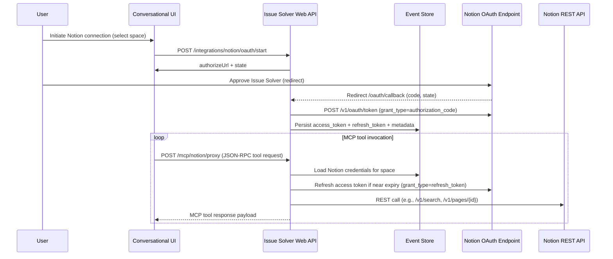

# 8. Adopt REST-Backed MCP Tools for Notion

Date: 2025-10-28

## Status

Proposed

## Context

- We need a Notion integration so the Issue Solver agent can reason over workspace docs via MCP tools. This work is new and not yet in production, so we can still choose the simplest viable architecture.
- For consistency with our GitHub MCP implementation we first tried to consume Notion’s hosted MCP server (`https://mcp.notion.com`). Despite following the documented discovery → dynamic client registration → PKCE flow, the authorization-code exchange keeps failing, preventing us from obtaining an MCP bearer token.【https://developers.notion.com/docs/mcp】【https://mcp.notion.com/.well-known/oauth-authorization-server】
- Running an alternative MCP service ourselves (e.g., the OSS Notion MCP server) would still require custom Notion logic, while adding operational overhead (deployment, patching, monitoring) for a feature that is still experimental.
- We need a dependable approach we can ship quickly without relying on undocumented behaviour or new infrastructure.

## Decision

Implement the Notion tools directly against the REST API and expose them through the existing MCP proxy (Option 3).

1. Reuse the OAuth credentials obtained during the connect flow (authorization-code + refresh token).【https://developers.notion.com/docs/authorization】
2. Implement MCP tool handlers in our backend that call Notion REST endpoints (e.g., search, database/query, page content).【https://developers.notion.com/reference】
3. Remove the experimental `/integrations/notion/mcp/oauth/*` endpoints and related credential plumbing introduced while exploring the remote MCP flow.

## Consequences

- **Fastest path to value:** We ship working Notion tools without waiting on remote MCP fixes.
- **Full control:** We own request logging, throttling, and error handling instead of debugging opaque 400s from `mcp.notion.com`.
- **Operational simplicity:** No additional services or secrets to host; we stay within the current deployment footprint.
- **Ongoing maintenance:** Tool logic lives in our codebase; we must track Notion REST API changes.

## Alternatives Considered

- **Keep pursuing the remote MCP flow:** Blocked today—authorization codes returned from Notion’s callback are rejected by their own token endpoint despite adhering to the documented PKCE + DCR sequence.
- **Host an open-source Notion MCP server:** Technically feasible, but adds operational burden (infrastructure, upgrades, security reviews) with little benefit over calling the REST API ourselves.【https://github.com/notionhq/notion-mcp-server】

## Risks & Mitigations

- **Rate limiting / quotas:** Centralize REST calls through our proxy so we can apply retries and backoff using the limits noted in Notion’s API policy.【https://developers.notion.com/reference/request-limits】
- **Scope coverage:** Start with the specific tools required for the Issue Solver workflow; add new ones iteratively as use cases emerge.
- **Future parity:** If Notion eventually stabilizes the hosted MCP flow, we can reassess and potentially migrate since the client‑side contract (MCP tools) remains unchanged.

## Follow-Up

1. Remove the experimental remote MCP code paths and clean up unused credential fields.
2. Implement the initial REST-backed MCP tools (e.g., list databases, search pages, read page content) with unit/integration tests.
3. Add telemetry around tool latency and Notion API errors to monitor reliability.
4. Update user-facing documentation to clarify that Notion MCP tooling runs on our infrastructure.

## References

- Notion OAuth overview: https://developers.notion.com/docs/authorization
- Notion MCP documentation: https://developers.notion.com/docs/mcp
- Notion authorization-server metadata (public discovery): https://mcp.notion.com/.well-known/oauth-authorization-server
- Notion API request limits: https://developers.notion.com/reference/request-limits
- Notion HQ OSS MCP server (self-host option): https://github.com/notionhq/notion-mcp-server

## Target Flow (Rest-Backed MCP Tools)

## Remote MCP Attempts (Current Understanding)

- We followed the documented sequence: fetch `/.well-known/oauth-protected-resource`, register a client, initiate PKCE, and exchange the authorization code at `https://mcp.notion.com/token`.
- The token endpoint consistently returns `400 invalid_request` errors (initially “Auth code must be a valid UUID,” then “Invalid code”) even after removing the signed suffix Notion appends to the code.
- Hypothesis: Notion’s MCP authorization code might be scoped to a different client/redirect flow than the public integration. The documentation references the same `/v1/oauth/token` path but may require partner-specific credentials or additional metadata we do not have.
- We have no confirmation from Notion support or changelog that this flow is available to third parties today, so we defer further work until there is clearer guidance.
