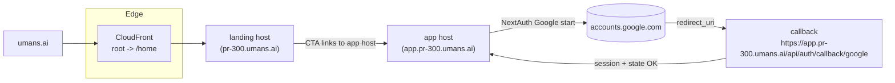

# 8. Keep Auth/Billing on App Host and Add Apex Landing Redirect

Date: 2025-12-02

## Status

Accepted

## Context

- Two faces per env: landing at `<env>.umans.ai` (or apex) and app/auth at `app.<env>.umans.ai`.
- Auth (NextAuth/Google) and billing (Stripe) must stay on the app host to keep cookies/state consistent.
- Root/apex must redirect to the landing page; DNS/App Runner can’t do path rewrites.

### Problems we hit

- Landing-origin auth led to OAuth state cookies on `<env>.umans.ai` but callbacks on `app.<env>.umans.ai` → NextAuth `error=Configuration`.
- Client links lacked a reliable app origin (public env), so they sometimes stayed on the landing host.

## Decision

- Keep `/home` as landing; root/apex redirect to `/home` via a tiny CloudFront distro that issues a 301 to `https://app.<host>/home` (query preserved). CloudFront uses a placeholder origin but always responds from a viewer-request function.
- CloudFront redirect moves users to the app host before auth/billing; UI links can remain host-relative after that.
- Avoid host heuristics in UI; keep auth/billing on the app host.

### Principles / guardrails

- One canonical host for auth and billing (app subdomain); landing stays separate.
- Avoid hostname guessing in UI; auth/billing stay on the app host via redirect.

## Consequences

- Landing requests immediately 301 to `app.<host>/home`, so auth state and callbacks share the same domain.
- CTAs use the configured app origin; billing and auth stay on the app host.
- Minimal infra: one small CloudFront distro per env for the redirect; app DNS unchanged.

### Checklist for future changes

- If `error=Configuration`: confirm callback host is authorized; ensure requests/callbacks are on the app host (redirect in place).

## Alternatives Considered

- Browser host inference: fragile; breaks OAuth.
- App-level `/` redirect: interferes with auth middleware; doesn’t solve apex cleanly.

## Risks & Mitigations

- CloudFront adds a small footprint; limited to landing host redirect only.

## Follow-Up

1. Consider a dedicated Google OAuth client for previews to avoid per-preview callback edits.

## References

- Code: `conversational-ui/app/landing/page.tsx`, `conversational-ui/components/landing-navbar.tsx`, `conversational-ui/app/go-to-app/page.tsx`
- Infra: `operations/02-deploy/apex-redirect.tf` (CloudFront root→/home redirect)
- Billing precedence example: `conversational-ui/app/api/billing/checkout/route.ts`

## Diagram

