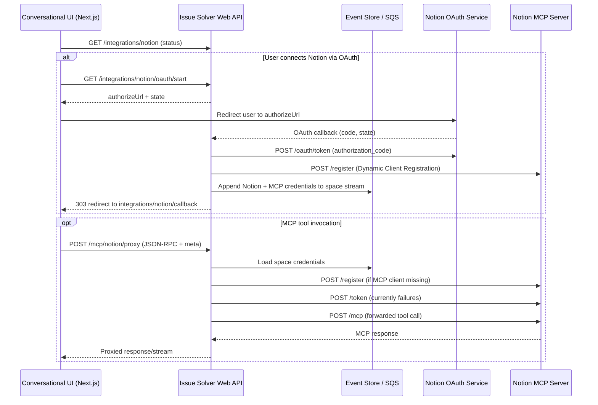

# Notion MCP Integration Investigation (October 24, 2025)

## Architecture Overview

**Why the proxy?** Tokens remain in the Issue Solver backend, enabling space-centric access (ADR-0003) and a uniform MCP surface for GitHub, Notion, and future tools. Conversational UI only sends MCP requests with `space_id`/`user_id`; the backend injects credentials, records events through SQS-backed event sourcing, and mediates all outbound calls.

## Incident Summary
- **Symptom:** Requests to `POST /mcp/notion/proxy` consistently failed with `401 Unauthorized` (`invalid_token` or `invalid_client`) responses from `https://mcp.notion.com/mcp` after a user initiated the Notion MCP tool from the UI.
- **Key Observations:**
  - The existing proxy forwarded the Notion REST OAuth access token directly to the MCP endpoint.
  - Manual tokens (prefix `ntn_…`) and OAuth access tokens (prefix `secret_…`) were both rejected.
  - The MCP endpoint responds with `WWW-Authenticate: Bearer realm="OAuth", error="invalid_token"` when the bearer is not MCP-specific.
  - After introducing a token exchange step targeting `https://mcp.notion.com/token`, the endpoint responded with `invalid_client`, indicating the token endpoint expects additional client metadata or a different authentication method.

## Timeline
- **Before Oct 24:** Proxy returned 401 from Notion MCP; access tokens were logged in plaintext and no OAuth metadata was leveraged.
- **Oct 24 (morning):** Enforced OAuth-only integrations, removed token logging, and ensured that `ensure_fresh_notion_credentials` rejects non-OAuth credentials.
- **Oct 24 (midday):** Added RFC 8693 token exchange attempts via the REST OAuth endpoint; Notion returned 400 (`grant_type` not supported).
- **Oct 24 (afternoon):**
  - Discovered Notion MCP protected resource metadata endpoint.
  - Implemented metadata discovery to obtain the authorization server and token endpoint, plus token caching scaffolding.
  - Adjusted requests to use `application/x-www-form-urlencoded`, as required by Notion.
  - Added support for `client_secret_basic` and `client_secret_post` auth methods based on advertised capabilities.
- **Latest State:** Dynamic client registration now succeeds (`201 Created`), but the subsequent token request fails with `400 {"error":"unsupported_grant_type"}` when we submit `grant_type=urn:ietf:params:oauth:grant-type:token-exchange`. Manual end-to-end flow still fails at the MCP exchange step.

## Root Causes Identified
1. **Missing MCP Token Exchange:** The proxy never exchanged the OAuth access token for the MCP-specific bearer; MCP endpoint rejects non-MCP tokens.
2. **Unknown Token Endpoint Auth Method:** Even with discovery, Notion’s MCP token endpoint now rejects the client credentials, implying either:
   - The client must be registered separately for MCP (`client_id`/`client_secret` pair not present in MCP auth server), or
   - Additional parameters (e.g., `audience`, `resource`) or scopes must match an MCP-specific registration.

## Changes Implemented
- **OAuth credential enforcement:** Reject manual tokens; refresh and rotate tokens only via OAuth.
- **Logging hygiene:** Removed plaintext token logs; added debug logs for metadata keys and token lengths only.
- **MCP metadata discovery:** Fetch and cache `https://mcp.notion.com/.well-known/oauth-protected-resource` and `.well-known/oauth-authorization-server` to determine token endpoint, supported auth methods, and resource identifier.
- **Token exchange helper:** Added `get_mcp_access_token` to exchange the refreshed OAuth access token for an MCP token using advertised endpoint and supported auth method (Basic or POST).
- **Dynamic client registration:** Discovery logic fetches MCP metadata, performs RFC 7591 registration, and now persists the returned `client_id`/`client_secret` per space.  Token exchange still fails because the advertised grant types do not include token exchange.
- **HTTP form encoding:** All OAuth-related requests now use `application/x-www-form-urlencoded`.
- **Tests:** Updated mocks to simulate MCP token retrieval, added new failure-path coverage, and ensured auth mode tracking for credentials.

## Updated Findings (Oct 24, 2025 – 4:45 PM)
- Fetching the MCP protected-resource metadata (`https://mcp.notion.com/.well-known/oauth-protected-resource`) succeeds and advertises at least one authorization server.
- The authorization-server metadata includes:
  - `token_endpoint`: `https://mcp.notion.com/token`
  - `token_endpoint_auth_methods_supported`: `["client_secret_post"]`
  - `registration_endpoint`: `https://mcp.notion.com/register`
- Notion’s hosted MCP service requires **Dynamic Client Registration (DCR)**. Standard REST integration credentials (`NOTION_OAUTH_CLIENT_ID/SECRET`) are **not** recognized by the MCP authorization server.
- MCP Inspector/third-party guides (Stacklok, Traefik Hub, Qiita, etc.) confirm the required flow: discover metadata > POST to `registration_endpoint` > persist returned `client_id`/`client_secret` > execute OAuth code/token exchanges with the registered client.
- Registration returns a new MCP client ID/secret, but `grant_types_supported` in the metadata includes only `authorization_code` and `refresh_token`; the token endpoint rejects token exchange with `unsupported_grant_type`. We must either request a supported grant (likely `client_credentials` or `authorization_code`) or adjust the registration payload to match Notion’s expected flow.

## Outstanding Issues
- **Finalize MCP token grant:** Determine which grant type Notion expects after DCR (e.g., `client_credentials` or another documented flow) and adjust the exchange accordingly.
- **Credential lifecycle:** Need a secure storage story (event store record or secret manager) for the MCP client credentials and rotation strategy.
- **Token storage:** MCP access tokens are still minted on every proxy call; once DCR succeeds we should cache the short-lived token until expiry.
- **Documentation:** Need guidance on MCP client registration, expected scopes, and operational runbook for refreshing MCP integrations.

## Next Steps / Recommendations
1. **Confirm MCP client registration:** Engage with Notion documentation/support to determine if separate client credentials are required for MCP access.
2. **Validate configuration variables:** Ensure environment includes any MCP-specific secrets (e.g., `NOTION_MCP_CLIENT_ID`, `NOTION_MCP_CLIENT_SECRET`) if different from REST OAuth.
3. **Instrument retries/caching:** Once exchange succeeds, cache MCP token alongside OAuth credentials for its validity period.
4. **Update user-facing documentation:** Outline the reconnection flow and differentiate between standard Notion API access and MCP requirements.

--- 
*Prepared after iterative troubleshooting between Oct 22–24, 2025.*
