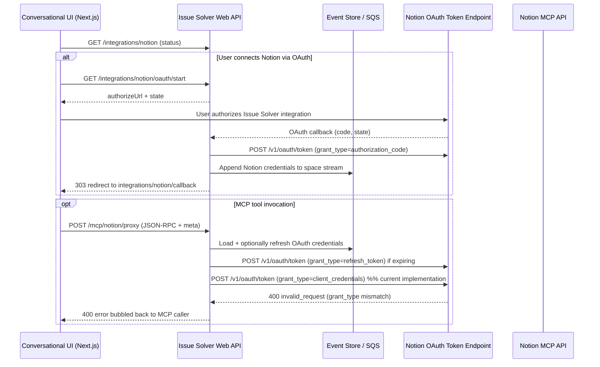

# Notion MCP Integration Investigation (October 28, 2025)

## Architecture Overview

**Why the proxy?** OAuth tokens stay in the Issue Solver backend so we can keep access scoped to a space (ADR-0003) and reuse the same MCP transport for multiple providers. The UI only carries `space_id` / `user_id`; the backend injects credentials, emits SQS events, and shields tokens from the browser.

## Latest Incident (October 28, 2025)
- **15:00:38–15:00:51:** User starts the OAuth connect flow for space `4241066a-c0a1-4fad-bf2e-f9ff807ef19e`. Authorization code exchange against `https://api.notion.com/v1/oauth/token` succeeds (`200 OK`).
- **15:01:16:** During the MCP proxy call, the backend refreshes the OAuth access token via `grant_type=refresh_token`; Notion returns `200 OK`.
- **15:01:17:** Immediately after the refresh, the backend submits another request to the same token endpoint with `grant_type=client_credentials`. Notion replies `400 {"error":"invalid_request","error_description":"body.grant_type should be \"authorization_code\" or \"refresh_token\" ..."}` and the MCP proxy responds to the UI with HTTP 400.

## Official Guidance Review
- Notion’s public integration authorization guide documents only two valid grants for `https://api.notion.com/v1/oauth/token`: `grant_type=authorization_code` (code exchange) and `grant_type=refresh_token` (refresh). `client_credentials` is not supported for public integrations, and the endpoint returns `invalid_request` when it is supplied.[1]

> [1] https://developers.notion.com/docs/authorization#public-integration-authorization-overview

## Code Path Review
- `src/issue_solver/webapi/routers/mcp_notion_proxy.py` loads credentials, refreshes them via `ensure_fresh_notion_credentials`, and then calls `get_mcp_access_token`.
- `get_mcp_access_token` (same module) delegates to `_exchange_for_mcp_token`.
- `_exchange_for_mcp_token` posts to `config.mcp_token_endpoint`. By default this is the standard OAuth endpoint (`https://api.notion.com/v1/oauth/token`). It always submits `{"grant_type": "client_credentials"}` plus an optional `scope`.
- The helper `_request_oauth_token` sends the payload as `application/x-www-form-urlencoded` using either `client_secret_basic` or `client_secret_post`, depending on configuration.
- Because the payload uses `client_credentials`, Notion rejects the request, matching the error seen in production logs.

## Root Cause
We assumed Notion exposes an MCP-specific bearer that must be minted with `grant_type=client_credentials`. The current implementation always attempts this exchange even though:
1. Our integration is registered as a public OAuth integration, and
2. Notion’s published token endpoint only allows `authorization_code` and `refresh_token` grants for that registration.[1]

The incorrect `client_credentials` request guarantees a 400 error, halting every MCP proxy call after a successful refresh.

## Impact
- MCP tool invocations for Notion fail immediately after the token refresh attempt, leaving the UI without a response from Notion.
- Tokens are refreshed successfully, but the unused access token is discarded when the MCP exchange fails.
- Event sourcing still records the refresh, which could mask the underlying failure when inspecting logs.

## Recommendations
1. **Stop sending `client_credentials` to `https://api.notion.com/v1/oauth/token`.** Reuse the freshly refreshed OAuth access token when talking to the MCP API, or confirm with Notion whether a different token endpoint exists for MCP.
2. **Gate any experimental MCP token exchange behind configuration.** Default behaviour for public integrations should be to skip the extra exchange unless we have verified docs and separate credentials.
3. **Document the supported grant types in code and tests.** Add assertions around `grant_type` values so regressions surface earlier.
4. **Revisit dynamic client registration logic.** `_register_mcp_client` still targets `https://mcp.notion.com/register`, but the current flow never consumes its output (because the subsequent token request goes to the public integration endpoint). Validate whether DCR is required; if not, remove it to simplify the path.
5. **Communicate expectations with stakeholders.** Update runbooks to clarify that only `authorization_code` and `refresh_token` are valid for the Notion public integration token endpoint.

## Open Questions
- Does Notion expose an MCP-specific authorization server with its own token endpoint/grant types, or should we always use the standard OAuth access token when calling `https://mcp.notion.com/mcp`?
- If MCP requires a different client registration, how do we obtain it, and can it coexist with our public integration client ID?
- Are there rate limits or scope constraints when reusing the standard access token against MCP endpoints?

---
*Prepared by reviewing production logs and current implementation on October 28, 2025.*
