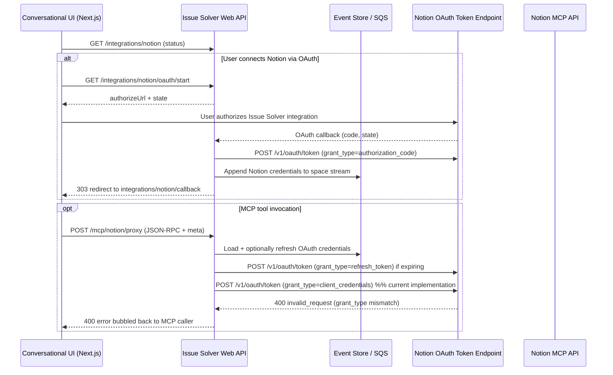
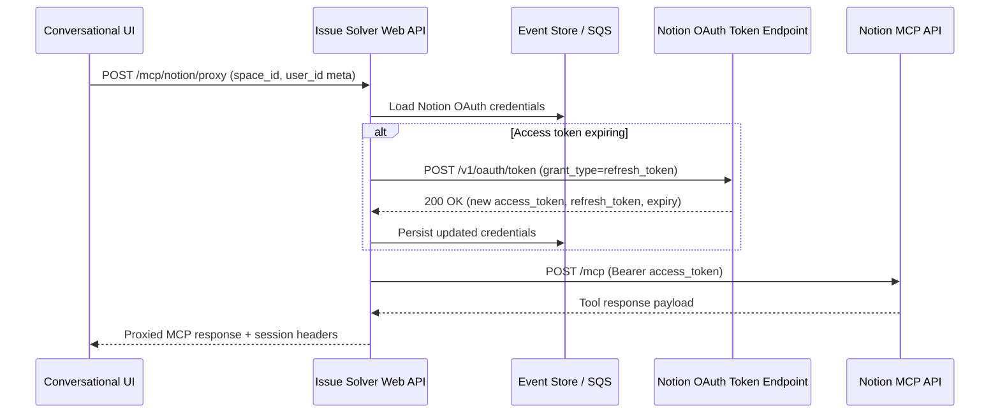

# Notion MCP Integration Investigation (October 28, 2025)

## Architecture Overview



**Why the proxy?** OAuth tokens stay in the Issue Solver backend so we can keep access scoped to a space (ADR-0003) and reuse the same MCP transport for multiple providers. The UI only carries `space_id` / `user_id`; the backend injects credentials, emits SQS events, and shields tokens from the browser.

## Target Flow (Once Fixed)



## Latest Incident (October 28, 2025)
- **15:00:38–15:00:51:** User starts the OAuth connect flow for space `4241066a-c0a1-4fad-bf2e-f9ff807ef19e`. Authorization code exchange against `https://api.notion.com/v1/oauth/token` succeeds (`200 OK`).
- **15:01:16:** During the MCP proxy call, the backend refreshes the OAuth access token via `grant_type=refresh_token`; Notion returns `200 OK`.
- **15:01:17:** Immediately after the refresh, the backend submits another request to the same token endpoint with `grant_type=client_credentials`. Notion replies `400 {"error":"invalid_request","error_description":"body.grant_type should be \"authorization_code\" or \"refresh_token\" ..."}` and the MCP proxy responds to the UI with HTTP 400.
- **15:38:06:** After deploying a change that reuses the refreshed OAuth access token, the proxy forwards the MCP request with that bearer token. Notion MCP responds `401 {"error":"invalid_token","error_description":"Invalid token format"}` and the proxy bubbles the 401 back to the caller.
- **15:49:52:** After reverting to the previous implementation, the MCP proxy again calls `grant_type=client_credentials` and receives the original `400 invalid_request` error, confirming we are back to the pre-experiment behaviour.

## Official Guidance Review
- Notion’s public integration authorization guide documents only two valid grants for `https://api.notion.com/v1/oauth/token`: `grant_type=authorization_code` (code exchange) and `grant_type=refresh_token` (refresh). `client_credentials` is not supported for public integrations, and the endpoint returns `invalid_request` when it is supplied.[1]

> [1] https://developers.notion.com/docs/authorization#public-integration-authorization-overview

## Code Path Review
- `src/issue_solver/webapi/routers/mcp_notion_proxy.py` loads credentials, refreshes them via `ensure_fresh_notion_credentials`, and then calls `get_mcp_access_token`.
- `get_mcp_access_token` now reuses stored MCP metadata to refresh tokens with `grant_type=refresh_token` instead of attempting an unsupported client-credentials grant.
- `get_mcp_access_token` now checks whether an MCP token already exists, refreshes it with `grant_type=refresh_token` when close to expiry, and otherwise signals the UI to re-run the authorization flow.
- `_request_oauth_token` supports the `token_endpoint_auth_method` advertised by discovery, including `none` for PKCE-only clients.
- The previous client-credentials attempt has been removed to comply with Notion's authorization server.

## Root Cause
We assumed Notion exposes an MCP-specific bearer that must be minted with `grant_type=client_credentials`. The current implementation always attempts this exchange even though:
1. Our integration is registered as a public OAuth integration, and
2. Notion’s published token endpoint only allows `authorization_code` and `refresh_token` grants for that registration.[1]

The incorrect `client_credentials` request guarantees a 400 error, halting every MCP proxy call after a successful refresh.

## Impact
- MCP tool invocations for Notion fail immediately after the token refresh attempt, leaving the UI without a response from Notion.
- Tokens are refreshed successfully, but the unused access token is discarded when the MCP exchange fails.
- Event sourcing still records the refresh, which could mask the underlying failure when inspecting logs.

## Recommendations
1. **Direct users through the dedicated MCP OAuth flow.** Surface the new `/integrations/notion/mcp/oauth/start` endpoint in the UI so spaces complete dynamic registration + PKCE before invoking MCP tools.
2. **Monitor and rotate MCP registrations.** Capture metrics around registration reuse, token refresh rates, and 401 challenges to detect stale MCP credentials early.
3. **Document environment requirements.** Operators must provide `NOTION_MCP_REDIRECT_URI`, confirm it is whitelisted in Notion, and understand the difference between REST (`NOTION_OAUTH_*`) and MCP (`NOTION_MCP_*`) configuration knobs.
4. **Validate persistence and replay safety.** Because MCP secrets are now stored in the event stream, audit serialization/deserialization and add redaction to any logs that surface these events.
5. **Schedule follow-up to consolidate token refresh logic.** Both REST and MCP refresh paths should eventually share caching/backoff behaviour to avoid redundant event writes.

## Remediation (October 28, 2025 – 3:45 PM PDT)
- Added `/integrations/notion/mcp/oauth/start` and `/integrations/notion/mcp/oauth/callback` endpoints that execute the documented flow: dynamic client registration, PKCE challenge, authorization-code exchange, and resource-scoped refresh token storage.
- Extended event models (`NotionIntegrationConnected` / `TokenRotated`) and `NotionCredentials` to persist MCP client metadata, access/refresh tokens, expiry, and optional client secrets.
- Updated `_request_oauth_token` to support `token_endpoint_auth_method="none"` and optional `resource` parameters, enabling compliant MCP exchanges.
- Reworked `_upsert_notion_integration` to merge REST and MCP credential updates without clobbering existing state, and to persist MCP metadata alongside standard tokens.
- Refactored `get_mcp_access_token` to refresh MCP tokens when needed (using stored metadata) instead of minting client-credential tokens that Notion rejects.
- Introduced PKCE helpers and configuration defaults (`NOTION_MCP_*`) so deployments can override endpoints or challenge methods when Notion updates the service.
- Updated the Conversational UI dialog to surface MCP authorization status and trigger the new `/mcp/oauth/start` flow so users complete both steps from one place.

## Discovery Results (October 28, 2025 – 11:14 AM PDT)
- `GET https://mcp.notion.com/.well-known/oauth-protected-resource` returns:
  ```json
  {
    "resource": "https://mcp.notion.com",
    "resource_name": "Notion MCP (Beta)",
    "resource_documentation": "https://developers.notion.com/docs/mcp",
    "authorization_servers": ["https://mcp.notion.com"],
    "bearer_methods_supported": ["header"]
  }
  ```
- `GET https://mcp.notion.com/.well-known/oauth-authorization-server` yields:
  ```json
  {
    "issuer": "https://mcp.notion.com",
    "authorization_endpoint": "https://mcp.notion.com/authorize",
    "token_endpoint": "https://mcp.notion.com/token",
    "registration_endpoint": "https://mcp.notion.com/register",
    "response_types_supported": ["code"],
    "response_modes_supported": ["query"],
    "grant_types_supported": ["authorization_code", "refresh_token"],
    "token_endpoint_auth_methods_supported": [
      "client_secret_basic",
      "client_secret_post",
      "none"
    ],
    "revocation_endpoint": "https://mcp.notion.com/token",
    "code_challenge_methods_supported": ["plain", "S256"]
  }
  ```
- `POST https://mcp.notion.com/register` (DCR) with `token_endpoint_auth_method="none"` returns:
  ```json
  {
    "client_id": "UCQUl3nAr0S5CaHF",
    "redirect_uris": ["https://example.com/notion/mcp/callback"],
    "client_name": "Issue Solver MCP Investigation",
    "grant_types": ["authorization_code", "refresh_token"],
    "response_types": ["code"],
    "token_endpoint_auth_method": "none",
    "registration_client_uri": "/register/UCQUl3nAr0S5CaHF",
    "client_id_issued_at": 1761664619
  }
  ```

**Key takeaways**
- The MCP authorization server is **not** `https://api.notion.com/v1/oauth/token`; it exposes its own `/authorize`, `/token`, and `/register` endpoints.
- Only the authorization-code + refresh-token grants are supported, and PKCE is available (`S256` preferred).
- `token_endpoint_auth_methods_supported` includes `"none"`, and the live DCR response contains **no client secret**, confirming MCP clients are public (PKCE-only) by default.
- The protected resource advertises the `resource` value `https://mcp.notion.com`; this should be passed during authorization and refresh requests if the server expects resource indicators (RFC 8707).

## External Research (October 28, 2025)
- Notion’s official MCP documentation reiterates that remote connections must complete the hosted OAuth flow; pre-issued REST tokens are not accepted by `https://mcp.notion.com/mcp`.citeturn2view0
- Community tear-downs of the Notion MCP reference server show an RFC 9728 compliant sequence: the initial 401 challenge advertises `/.well-known/oauth-protected-resource`, clients dynamically discover the authorization server, perform dynamic client registration, then complete a PKCE-protected authorization-code flow before calling MCP APIs.citeturn19view0
- Broader MCP OAuth guidance highlights the importance of passing the `resource` parameter during both the authorization-code exchange and subsequent refreshes so the issued token is scoped to the MCP endpoint rather than the generic API.citeturn17search2turn19view0

## Decision Options (ADR)

### Option 1 – Keep pursuing Notion’s remote MCP
- Relies on Notion’s hosted MCP endpoints (`/authorize`, `/token`, `/register`) that are described in official docs.citeturn2view0
- Pros: aligns with Notion’s long-term MCP experience if it becomes stable.
- Cons: our attempts still fail at the authorization-code exchange despite following the documented flow, so we have no reliable path to production.

### Option 2 – Host our own MCP server
- Deploy the open-source `notion-mcp-server` (official or community forks) inside our infrastructure and proxy Issue Solver traffic through it.citeturn2view0turn0search6
- Pros: full control over behaviour and debugability.
- Cons: adds operational cost (hosting, updates, monitoring) without eliminating the need to maintain custom tooling code.

### Option 3 – Wrap the Notion REST API as MCP tools (recommended)
- Keep using the OAuth flow that already works (`grant_type=authorization_code` + `refresh_token`) and expose Notion REST operations as first-party MCP tools from our backend.citeturn0search0
- Pros: fastest path to a functional integration, no new infrastructure, predictable auth lifecycle.
- Cons: we own the tool implementation/maintenance, but that’s already required for custom behaviour.

**Decision:** pursue Option 3. It unblocks the Notion integration immediately while leaving the door open to revisit a hosted MCP solution once Notion’s flow is reliable.

### Inferred Target Flow
1. **Trigger 401 challenge:** An unauthenticated POST to `https://mcp.notion.com/mcp` returns `WWW-Authenticate` with a `resource_metadata` link.
2. **Fetch protected-resource metadata:** GET `https://mcp.notion.com/.well-known/oauth-protected-resource` to retrieve the MCP resource identifier, supported scopes, and the list of trusted authorization servers.
3. **Fetch authorization-server metadata:** For each issuer, GET `/.well-known/oauth-authorization-server` to learn the proper `authorization_endpoint`, `token_endpoint`, `registration_endpoint`, supported grant types, and PKCE requirements.
4. **Perform dynamic client registration:** POST to the advertised registration endpoint (likely unauthenticated) and persist the returned MCP-specific `client_id` (and `client_secret` if provided) with the space’s credentials.
5. **Complete OAuth with PKCE:** Launch the browser flow against the discovered `authorization_endpoint`, including `code_challenge`, `code_challenge_method=S256`, and `resource=https://mcp.notion.com/mcp` (or the advertised resource). Exchange the code at the discovered token endpoint with `grant_type=authorization_code`; include PKCE verifier and resource parameter.
6. **Store and refresh tokens:** Persist the MCP access token/refresh token pair, along with expiry. Refresh using `grant_type=refresh_token`, again including `resource` if required by the authorization server.
7. **Use MCP-scoped bearer:** Forward the MCP access token to `https://mcp.notion.com/mcp` and `https://mcp.notion.com/sse` without additional translation.

### Remaining Gaps
- **Existing spaces migration:** Spaces that previously attempted MCP must be prompted to re-authorize; add detection and nudges so they do not continue hitting 400/401 responses.
- **Token caching/back-off:** `get_mcp_access_token` writes a rotation event on every refresh; introduce memoization or concurrency guards so simultaneous MCP calls do not stampede the token endpoint.
- **Security review:** New event payloads contain MCP client IDs and optional secrets—ensure redaction, rotation, and retention policies meet expectations before promoting to production.
- **Automated coverage:** Add FastAPI tests around the new start/callback routes (including PKCE failure cases) and extend proxy tests to exercise the refresh path.

### Next Actions
1. Build a background job or admin command to identify spaces lacking MCP credentials and enqueue re-authorization notices.
2. Introduce in-memory caching (per space) or optimistic locking around MCP refreshes to curb duplicate event writes and unnecessary token requests.
3. Extend the test suite to cover the new routes and event mutations, stubbing outbound HTTP calls to Notion so CI can validate the path without network access.
4. Document the operational runbook (registration cleanup, revocation, redirect URI changes) for on-call engineers and customer support.

## Open Questions
- What is the guaranteed lifetime of MCP access/refresh tokens, and does Notion enforce additional throttling or concurrency limits we should respect?
- Can we safely reuse a single MCP client registration across multiple spaces, or should each space maintain its own client for isolation/auditability?
- Does Notion plan to expand scope/resource requirements for MCP, and how will those changes be surfaced (webhook, metadata versioning, etc.)?

---
*Prepared by reviewing production logs and current implementation on October 28, 2025.*
