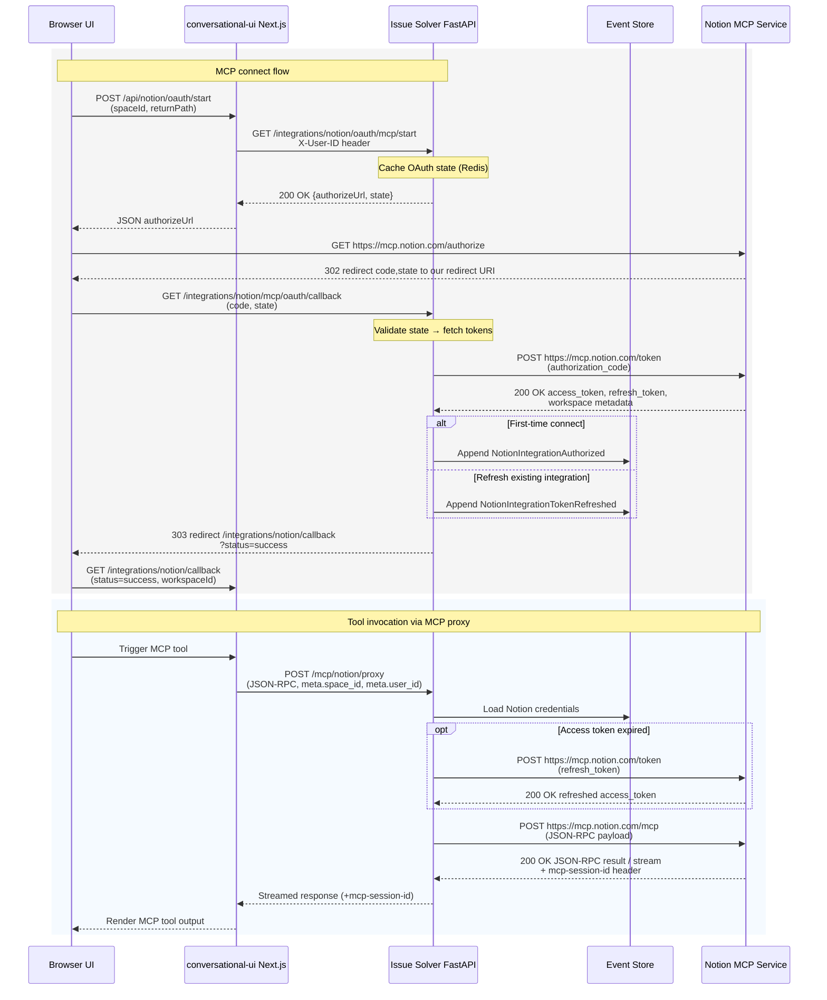

# Notion MCP Integration – Current Flow

> The classic Notion OAuth flow has been retired. The integration now relies **only** on Notion's Model Context Protocol (MCP) authorization.

## End-to-End Flow

1. **User starts the flow**
   - Frontend calls `POST /api/notion/oauth/start` (Next.js route).  
   - This proxies to FastAPI `GET /integrations/notion/oauth/mcp/start`, which builds the Notion authorization URL, stores a short-lived state in Redis, and returns it to the browser.

2. **User approves in Notion**
   - Notion presents the MCP consent dialog.
   - On success Notion redirects back to `GET /integrations/notion/mcp/oauth/callback`.

3. **Backend stores MCP credentials**
   - FastAPI exchanges the authorization code for an MCP refresh token.
   - The refresh token is encrypted and appended to the event stream (`NotionIntegrationAuthorized` / `NotionIntegrationTokenRefreshed`).
   - No classic access token is stored; the integration is considered "connected" when an MCP refresh token exists.

4. **Proxying tool calls**
   - The UI sends JSON-RPC payloads to `POST /mcp/notion/proxy`.  
   - The proxy loads the stored credentials, refreshes them if necessary, exchanges for an MCP access token, and forwards the request to `https://mcp.notion.com/mcp`.
   - Responses are streamed back verbatim so the MCP client can decode them.

### Sequence Diagram (Connect + Tool Invocation)

_Source: `conversational-ui/app/api/notion/oauth/start/route.ts`, `issue_solver/src/issue_solver/webapi/routers/notion_integration.py`, `conversational-ui/lib/ai/tools/notion_mcp.ts`, `issue_solver/src/issue_solver/webapi/routers/mcp_notion_proxy.py`._



## Required Environment Variables

Add the following variables to FastAPI:

```bash
NOTION_MCP_CLIENT_ID=...
NOTION_MCP_CLIENT_SECRET=...
# Optional overrides
# NOTION_MCP_OAUTH_REDIRECT_URI="https://api.example.com/integrations/notion/mcp/oauth/callback"
# NOTION_MCP_RETURN_BASE_URL="https://app.example.com"
# NOTION_MCP_TOKEN_AUTH_METHOD="client_secret_post"
# NOTION_MCP_TOKEN_SCOPE="..."
# NOTION_MCP_STATE_TTL_SECONDS=600
```

Frontend (Next.js) still requires `CUDU_ENDPOINT` so the MCP client knows where to proxy requests.

## Local Development Notes

- Run FastAPI and Next.js locally, then set `NOTION_MCP_OAUTH_REDIRECT_URI=http://localhost:8000/integrations/notion/mcp/oauth/callback` and `NOTION_MCP_RETURN_BASE_URL=http://localhost:3000` to get end-to-end redirects working.
- Generate client credentials once using `just export-notion-mcp-credentials` and reuse them.
- When testing, you can clear credentials with `ensure_fresh_notion_credentials` or by removing the integration from the Notion UI.

## UI Expectations

- The integration dialog only references MCP. Once a refresh token is stored the status moves to **MCP connected**.
- If the proxy returns `invalid_grant`, the backend clears the stored refresh token and the UI prompts the user to reconnect.

## Troubleshooting

| Symptom | Typical Cause | Fix |
| --- | --- | --- |
| `401 Missing Notion MCP tokens` | User never completed the MCP consent dialog | Re-run the connect flow |
| `invalid_grant` in logs | Stored refresh token revoked in Notion | User must reconnect |
| Chat tools missing | Frontend MCP client failed to initialise | Check `CUDU_ENDPOINT` and browser console |
| Proxy returns `500` | Stale MCP access token and refresh failed | Retry after reconnecting Notion MCP from the integrations page |

The integration is now fully MCP-centric: there are no classic OAuth tokens or endpoints to maintain.

## Curious Notes

- The OAuth router sends Notion a `Notion-Version` header of `2022-06-28`, while the MCP proxy upgrades to `2025-09-03`. Confirm with the Notion MCP changelog that both values remain supported, or consider aligning them to avoid subtle API mismatches.
- `StreamableHTTPClientTransport` keeps the proxy on `POST`; if a client retries with `GET /mcp/notion/proxy` (observed during long-running MCP calls) FastAPI returns `405 Method Not Allowed`. The log is harmless but worth watching if you swap transports.
- `ensure_fresh_notion_credentials` refreshes MCP tokens ~60 seconds before expiry, writes the new access/refresh pair to the event stream, and returns the updated credentials so subsequent calls reuse them.
- When Notion reports `invalid_grant`, the backend appends a `NotionIntegrationAuthorizationFailed` event and surfaces a reconnect prompt instead of mutating existing rotation events.

## External References

- Notion developer docs – Model Context Protocol: <https://developers.notion.com/docs/model-context-protocol>
- Notion OAuth token exchange reference: <https://developers.notion.com/reference/post-token>
