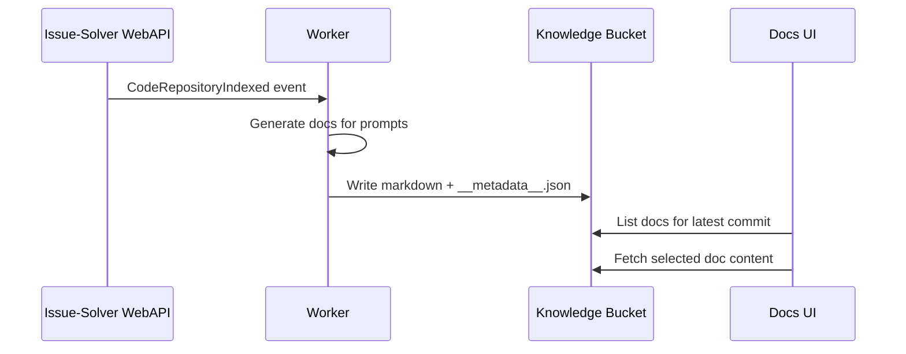

# Auto Documentation — Current System

Status: Current
Last updated: 2026-01-07

## 1) Summary

Umans supports automatic documentation generated from code via prompt definitions stored in the backend. Docs are produced by a worker pipeline, stored in S3, and displayed in the Docs tab. This spec documents the current behavior only.

## 2) Scope

- Auto-doc prompt configuration
- Doc generation workflow on indexing
- Manual doc generation
- Storage format and metadata

## 3) Quick Flow

- Prompts are defined per knowledge base (event-sourced).
- A code index event triggers doc generation for each prompt.
- The worker generates markdown and writes to S3.
- The Docs UI reads S3 and renders the latest commit’s docs.

## 4) Key Concepts

- Knowledge base: the repo-linked identifier used by indexing and docs.
- Prompt: a named instruction used to generate one doc file.
- Code version: the commit SHA used as the docs version.
- Origin: metadata indicating where a doc came from (auto/manual).

## 5) Current Behavior

### 5.1 Prompt Configuration (Backend)

- Prompt definitions are event-sourced with:
  - `DocumentationPromptsDefined`
  - `DocumentationPromptsRemoved`
- Prompts are loaded via `load_auto_documentation_setup` and represent the latest configuration for a knowledge base.

### 5.2 Generation Flow (Worker)

- On `CodeRepositoryIndexed`, the worker emits `DocumentationGenerationRequested` for each prompt (mode `update`).
- On `DocumentationGenerationRequested`, the worker:
  1) Clones the repo at the target commit.
  2) Seeds previous auto-docs (when mode is `update`).
  3) Runs the docs agent to generate markdown files.
  4) Stores generated docs in S3.
  5) Emits `DocumentationGenerationCompleted`.

### 5.3 Manual Generation (Backend)

- `POST /repositories/{knowledge_base_id}/auto-documentation/generate`
  - Validates prompt exists.
  - Requires the repo to be indexed.
  - Emits `DocumentationGenerationRequested`.

### 5.4 Storage Format (S3)

- Docs are stored under:
  - `base/{knowledge_base_id}/docs/{commit_sha}/...`
- Metadata is stored in:
  - `__metadata__.json`
- Auto-docs are marked with `origin: auto`.

### 5.5 Docs UI

- Docs tab lists files from S3 and uses metadata to display origin and approvals.
- Doc prompts can be configured via the Docs Setup panel.

## 6) Diagrams

### 6.1 Index-to-Docs Sequence



### 6.2 Storage Layout

```mermaid
flowchart TD
  A[base/{knowledge_base_id}/docs/{commit_sha}/] --> B[index.md]
  A --> C[architecture/overview.md]
  A --> D[runbook.md]
  A --> E[__metadata__.json]
```

## 7) Failure Modes (Observed)

- No prompts defined: no auto-doc generation on index.
- Repo not indexed: manual generation returns 409.
- Missing prompt: manual generation returns 404.

## 8) Key Paths (Reference)

Backend:
- `src/issue_solver/events/auto_documentation.py`
- `src/issue_solver/worker/documenting/auto.py`
- `src/issue_solver/worker/documenting/s3_knowledge_repository.py`
- `src/issue_solver/webapi/routers/repository.py`

Frontend:
- `app/docs/[spaceId]/[[...path]]/page.tsx`
- `components/doc-prompts-panel.tsx`
- `app/api/docs/*` routes
