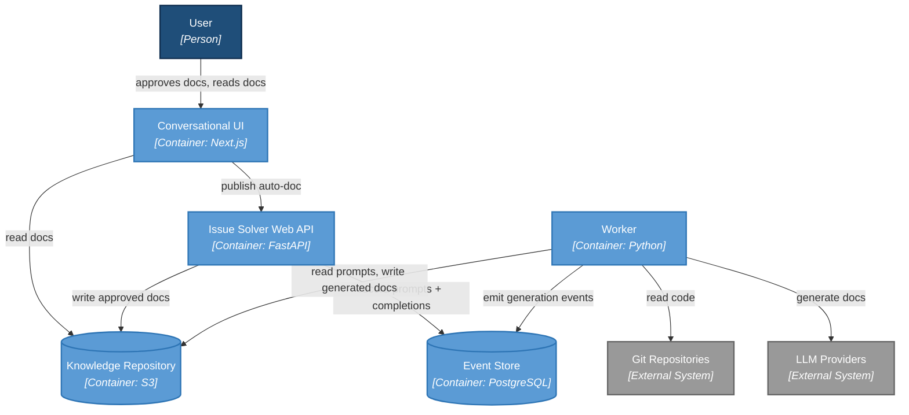

# Auto Documentation

Status: Current (implemented)
Last updated: 2026-01-10

## 1) Summary

Umans supports automatic documentation generated from code via prompt definitions stored in the backend. Docs are produced by a worker pipeline, stored in the knowledge repository (S3), and displayed in the Docs tab. The same pipeline also supports publishing an approved chat output directly into the latest auto-docs version.

## 2) Responsibilities

- Conversational UI
  - Collects user intent to publish and displays docs.
  - Reads docs directly from the knowledge repository for the latest commit.
- Web API (Issue Solver)
  - Validates repository connection and indexing status.
  - Defines/updates auto-doc prompts.
  - Writes approved docs to the knowledge repository.
  - Records `DocumentationGenerationCompleted` events.
- Worker
  - Generates docs from prompts on indexing or manual generation.
  - Writes generated docs to the knowledge repository.
  - Emits generation events.
- Event Store
  - Source of truth for prompt definitions and generation events.
- Knowledge Repository (S3)
  - Stores markdown files and metadata for each commit.

## 3) Architecture (C4-style overview)

## 4) Core Flows

### 4.1 Auto-doc generation on indexing (worker-driven)
1) Repo is indexed and `CodeRepositoryIndexed` is recorded.
2) The worker emits `DocumentationGenerationRequested` for each configured prompt.
3) The worker generates markdown using the docs agent and code at the indexed commit.
4) The worker writes docs and metadata to S3.
5) The worker emits `DocumentationGenerationCompleted`.

### 4.2 Manual generation (backend-triggered)
- `POST /repositories/{knowledge_base_id}/auto-documentation/generate`
  - Validates prompt exists and repo is indexed.
  - Emits `DocumentationGenerationRequested`.

### 4.3 Publish from conversation (backend writes directly)
1) The user approves an assistant response for publishing.
2) The client calls `POST /repositories/{knowledge_base_id}/auto-documentation/publish` with:
   - `path`, `content`, `promptDescription`
   - optional `source` envelope
3) The backend:
   - validates repo connection + latest indexed commit
   - defines the prompt mapping via `DocumentationPromptsDefined`
   - writes the approved markdown to S3
   - emits `DocumentationGenerationCompleted`

## 5) Storage & Metadata

- Docs are stored under:
  - `base/{knowledge_base_id}/docs/{commit_sha}/...`
- Metadata is stored in `__metadata__.json` alongside docs.
- Standard metadata:
  - `origin: auto`
  - `process_id`
- Optional source metadata (when provided):
  - `source_type`
  - `source_ref`
  - `source_meta_*` (flattened from `source.meta`)

Source envelope format:
- `source.type`: string (e.g., `conversation`)
- `source.ref`: opaque ref, recommended format for conversation:
  - `/chat/<chat_id>/message/<message_id>`
- `source.meta`: optional key-value map (flattened as `source_meta_*`)

## 6) APIs

- `GET /repositories/{knowledge_base_id}/auto-documentation`
- `POST /repositories/{knowledge_base_id}/auto-documentation/generate`
- `POST /repositories/{knowledge_base_id}/auto-documentation/publish`

## 7) Failure Modes

- No prompts defined: no auto-doc generation on index.
- Repo not indexed: manual generation and publish return 409.
- Missing prompt: manual generation returns 404.
- Empty content or invalid path: publish returns 400.

## 8) Key Code Paths (Reference)

Backend:
- `issue-solver/src/issue_solver/events/auto_documentation.py`
- `issue-solver/src/issue_solver/worker/documenting/auto.py`
- `issue-solver/src/issue_solver/worker/documenting/s3_knowledge_repository.py`
- `issue-solver/src/issue_solver/webapi/routers/repository.py`

Frontend:
- `conversational-ui/app/docs/[spaceId]/[[...path]]/page.tsx`
- `conversational-ui/components/doc-prompts-panel.tsx`
- `conversational-ui/app/api/docs/*`
