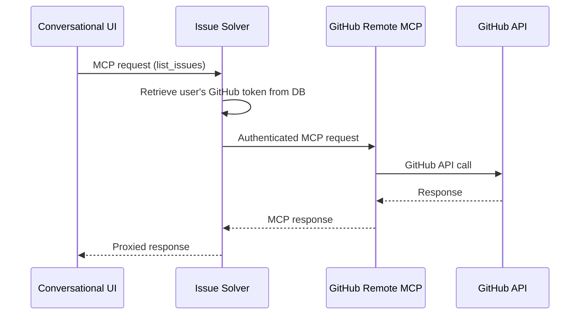

# GitHub MCP Integration for Conversational UI

**Conclusion first**: We need to enable the Conversational UI to access GitHub services (review commits, publish issues, find code owners, lookup files) while maintaining our security constraint that Git tokens remain exclusively in the Issue-Solver subsystem. The experiment will validate whether GitHub's remote MCP server can be proxied through Issue-Solver to provide GitHub integration capabilities without compromising our authentication boundaries.

This spike explores integrating GitHub's official MCP server to enhance the Conversational UI's GitHub capabilities while preserving our current security architecture.

## Falsifiable hypothesis

*Construct our hypothesis*

- We believe that **proxying GitHub's remote MCP server through Issue-Solver with user-specific token injection**
- Will drive **successful GitHub operations (list repos, get issues, search code) from Conversational UI without exposing Git tokens**
- Within **1/2 to 1 day (4-8 hours implementation + validation)**

## Experiment setup

*A brief description of the experiment*

### Current Architecture Constraint
- Issue-Solver subsystem: Holds all user-specific Git authentication tokens (stored per user/space)
- Conversational UI: Must NOT have direct access to Git tokens
- Need: Conversational UI requires GitHub service access for enhanced user experience

### GitHub MCP Server Options (Latest Info)

**Remote MCP Server** (Recommended for spike):
- Hosted by GitHub at `https://api.githubcopilot.com/mcp/`
- No local installation required
- Supports OAuth 2.0 and Personal Access Tokens
- Auto-updates with latest features

**Local MCP Server** (Fallback):
- Docker container: `ghcr.io/github/github-mcp-server`
- Requires local installation and management

### Proposed Solution: Remote MCP Proxy Pattern



### Implementation Plan (4-8 hours)

**Phase 1: MCP Proxy Setup (2-4 hours)**
1. **Issue-Solver MCP Proxy Endpoint**
   - Create `/api/mcp/github` endpoint in FastAPI
   - Implement request forwarding to `https://api.githubcopilot.com/mcp/`
   - Add user-specific GitHub token retrieval from database (based on user_id/space_id)

2. **Conversational UI MCP Client**
   - Install `@modelcontextprotocol/sdk`
   - Configure MCP client to use HTTP transport (not SSE - now obsolete)
   - Point to Issue-Solver proxy endpoint

**Phase 2: Validation (2-4 hours)**
1. **Core Operations Testing**
   - List repositories
   - Get issue details
   - Search code files
   - Handle authentication errors

2. **Performance & UX Assessment**
   - Measure response times
   - Test error propagation
   - Validate tool descriptions work correctly

### Success Criteria
- [ ] Conversational UI can list GitHub repositories without holding tokens
- [ ] Issue details can be fetched through proxy
- [ ] Code search functionality works end-to-end
- [ ] User-specific authentication flows through Issue-Solver only
- [ ] Response time overhead is acceptable (< 1 second additional latency)
- [ ] Error messages are meaningful to end users

### Available GitHub MCP Tools (Key Subset for Testing)
Based on official documentation:
- **Issues**: `get_issue`, `list_issues`, `search_issues`, `create_issue`
- **Repositories**: `get_file_contents`, `search_code`, `list_branches`
- **Pull Requests**: `get_pull_request`, `list_pull_requests`
- **Users**: `get_me` (for auth validation)

### Technical Implementation Approach

**Issue-Solver Proxy (Python/FastAPI)**:
```python
@router.post("/api/mcp/github")
async def proxy_github_mcp(request: dict, user_id: str = Depends(get_current_user)):
    # Retrieve user's GitHub token from database
    # Based on codebase: tokens are stored per user/space in repository connections
    user_token = await get_user_github_token(user_id)
    
    if not user_token:
        raise HTTPException(status_code=401, detail="No GitHub token found for user")
    
    # Add GitHub token to request headers
    headers = {"Authorization": f"Bearer {user_token}"}
    
    # Forward to GitHub's remote MCP server
    async with httpx.AsyncClient() as client:
        response = await client.post(
            "https://api.githubcopilot.com/mcp/",
            json=request,
            headers=headers
        )
        return response.json()
```

**Conversational UI Client (TypeScript/Next.js)**:
```typescript
const mcpClient = await experimental_createMCPClient({
  transport: {
    type: 'http', // Using HTTP transport (SSE is obsolete)
    url: process.env.CUDU_ENDPOINT + '/api/mcp/github',
  },
});

const tools = await mcpClient.tools();
```

### Risk Mitigation
1. **Token Exposure**: Ensure proxy strips all auth headers from client requests
2. **User Isolation**: Verify each user only accesses their own GitHub data
3. **Rate Limiting**: GitHub API limits apply to individual user tokens
4. **Error Handling**: MCP errors should be meaningful to Conversational UI
5. **Network Latency**: Additional hop may impact response times

## Results

*Record the qualitative or quantitative results of the experiment*

[To be filled during/after experiment execution]

### Quantitative Results
- Response time measurements (baseline vs proxied)
- Success/failure rates for different operations
- Error frequency and types

### Qualitative Results
- Developer experience assessment
- Integration complexity evaluation
- MCP tool discoverability and usability

## Conclusion

*Did the results match the hypothesis?*

*Or did they contradict the hypothesis?*

*And was the result clear enough?*

- [ ] VALIDATED ✅
- [ ] INVALIDATED ❌
- [ ] INCONCLUSIVE 🤷‍

[To be completed after experiment]

## Next steps

*And now, what? What would be our next steps?*

### If VALIDATED ✅
- Implement full GitHub MCP proxy integration
- Add comprehensive error handling and logging
- Extend to other Git services (GitLab, Azure DevOps)
- Document MCP proxy pattern for team knowledge base

### If INVALIDATED ❌
- Evaluate direct REST API approach (bypass MCP entirely)
- Consider GitHub App authentication model for better scoping
- Reassess security constraints vs functionality trade-offs
- Explore alternative integration patterns

### If INCONCLUSIVE 🤷‍
- Extend experiment with more comprehensive testing
- Gather team feedback on acceptable performance trade-offs
- Test with different GitHub operations and edge cases
- Consider hybrid approach (MCP for some operations, REST for others)

### Immediate Next Actions
1. Set up development environment with user GitHub token retrieval
2. Create basic proxy endpoint in Issue-Solver
3. Test GitHub remote MCP server connectivity with HTTP transport
4. Implement minimal Conversational UI integration
5. Document findings and recommendations